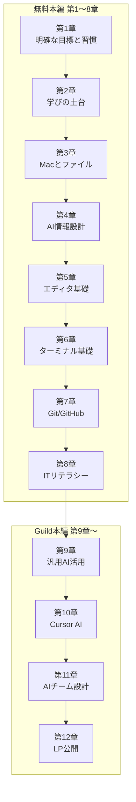

# Rebuild AI Guild — 学習ロードマップ

**Rebuild AI Guild** の学習ロードマップ（第1〜12章）です。

PCが苦手でも、Cursorで心が折れても、ここから小さく始められます。
1テーマは15〜30分を目安に、手を動かしながら進めてください。

## はじめに

初めての方は、次の順番で読んでください。

1. **[00 はじめに](教材/00-はじめに.md)** — 読む順番（2〜3分）
2. **[学びが続くための土台](教材/学びが続くための土台.md)** — 推奨（長め。一度に全部でなくてよい）
3. **[第1章 01 目標を整理する](教材/第01章-明確な目標と習慣/01-目標を整理する.md)** — 手を動かす最初のテーマ

- [教材一覧](教材/README.md) ｜ [答え一覧](答え/README.md)

## 学習管理スプレッドシート（スプシ）

第1章から使う **学習管理用テンプレート** です。目標・時間割・日報・週報を1冊にまとめられます。

| 項目 | 内容 |
|---|---|
| テンプレート | [ギルド学習管理シート.xlsx](assets/spreadsheet/ギルド学習管理シート.xlsx) |
| 置き場所 | [`assets/spreadsheet/`](assets/spreadsheet/) |
| 詳しい手順 | [第1章 02 学習管理スプシをコピーする](教材/第01章-明確な目標と習慣/02-学習管理スプシをコピーする.md) |

### ダウンロードして Google スプレッドシートで使う

1. 上の **[ギルド学習管理シート.xlsx](assets/spreadsheet/ギルド学習管理シート.xlsx)** を開き、画面右上の **Download**（ダウンロード）をクリックする
2. Mac の **ダウンロード** フォルダに保存されたことを確認する
3. ブラウザで [Google ドライブ](https://drive.google.com) を開き、**新規** → **ファイルのアップロード** から xlsx を選ぶ
4. アップロードしたファイルを開き、**Googleスプレッドシートで開く** をクリックする
5. 左上のタイトルを `Rebuild AI Guild 学習管理（自分の名前）` のように変える
6. 左下に `01_習慣設計` 〜 `05_週報月報` の **5つのシートタブ** があることを確認する

スプレッドシートは自動保存です。あとは [第1章 03 目標をスプシに書く](教材/第01章-明確な目標と習慣/03-目標をスプシに書く.md) から記入を始めてください。

## このリポジトリの見方

| 場所 | 内容 |
|---|---|
| このページ | 全体の地図（ロードマップ） |
| [`教材/`](教材/) | 教材本文 |
| [`答え/`](答え/) | 4択チェックの答え合わせ |
| [`assets/`](assets/) | 画像・スクショ・[スプレッドシート](assets/spreadsheet/) |

理解回では、教材を読んでから答えページへ進みます。答えページから教材本文へ戻るリンクもあります。

## 全体の流れ

**第1〜8章**は無料本編、**第9〜12章**は Guild 本編です。

---

## 第1章：明確な目標と習慣

[第1章の目次](教材/第01章-明確な目標と習慣/README.md)

| # | テーマ | 教材 | 答え |
|---|---|---|---|
| 01 | 目標を整理する | [教材](教材/第01章-明確な目標と習慣/01-目標を整理する.md) | — |
| 02 | 学習管理スプシをコピーする | [教材](教材/第01章-明確な目標と習慣/02-学習管理スプシをコピーする.md) | — |
| 03 | 目標をスプシに書く | [教材](教材/第01章-明確な目標と習慣/03-目標をスプシに書く.md) | — |
| 04 | 時間を見える化する | [教材](教材/第01章-明確な目標と習慣/04-時間を見える化する.md) | — |
| 05 | 毎日1アクションとトリガー | [教材](教材/第01章-明確な目標と習慣/05-毎日1アクションとトリガー.md) | — |
| 06 | 別案と3段階の最低ライン | [教材](教材/第01章-明確な目標と習慣/06-別案と3段階の最低ライン.md) | — |
| 07 | **スタート3週間ルール**（21日開始） | [教材](教材/第01章-明確な目標と習慣/07-スタート3週間ルール.md) | — |
| 08 | 日報・週報のはじめ | [教材](教材/第01章-明確な目標と習慣/08-日報・週報のはじめ.md) | — |
| 09 | うまくいかないとき考える | [教材](教材/第01章-明確な目標と習慣/09-うまくいかないとき考える.md) | — |

---

## 第2章：学びの土台を整える

[第2章の目次](教材/第02章-学びの土台/README.md)

| # | テーマ | 教材 | 答え |
|---|---|---|---|
| 00 | やめないための管理 | [教材](教材/第02章-学びの土台/00-やめないための管理.md) | — |
| 01 | 早く結果が欲しい——その欲に気づく | [教材](教材/第02章-学びの土台/01-早く結果が欲しい-その欲に気づく.md) | — |
| 02 | **考えすぎは不安のループ——堂々巡りに気づく** | [教材](教材/第02章-学びの土台/02-考えすぎは不安のループ-堂々巡りに気づく.md) | — |
| 03 | 5分を大切にする——塵も積もれば山となる | [教材](教材/第02章-学びの土台/03-5分を大切にする-塵も積もれば山となる.md) | — |
| 04 | 考える時間を大切にする——急がず丁寧に積み重ねる | [教材](教材/第02章-学びの土台/04-考える時間を大切にする-急がず丁寧に積み重ねる.md) | — |
| 05 | 人と比べない——一ヶ月前の自分と比べる | [教材](教材/第02章-学びの土台/05-人と比べない-一ヶ月前の自分と比べる.md) | — |
| 06 | 本質的に変えるのは思考の癖 | [教材](教材/第02章-学びの土台/06-本質的に変えるのは思考の癖.md) | — |
| 07 | 学びの4段階——知ったで満足しない | [教材](教材/第02章-学びの土台/07-学びの4段階-知ったで満足しない.md) | — |
| 08 | ゆっくり学ぶ——わからないまま進まない | [教材](教材/第02章-学びの土台/08-ゆっくり学ぶ-わからないまま進まない.md) | — |
| 09 | AIは増幅装置——1年後の視点と進め方 | [教材](教材/第02章-学びの土台/09-AIは増幅装置-1年後の視点と進め方.md) | — |
| 10 | **遠回りしてでも調べる——流さないことが土台になる** | [教材](教材/第02章-学びの土台/10-遠回りしてでも調べる-流さないことが土台になる.md) | — |
| 11 | 習慣ルールを見直す | [教材](教材/第02章-学びの土台/11-習慣ルールを見直す.md) | — |
| 12 | 週報で学びをつなぐ | [教材](教材/第02章-学びの土台/12-週報で学びをつなぐ.md) | — |
| 13 | スプシで時間と別案を整える | [教材](教材/第02章-学びの土台/13-スプシで時間と別案を整える.md) | — |

---

## 第3章：Macとファイル

[第3章の目次](教材/第03章-Macとファイル/README.md)

| # | テーマ | 教材 | 答え |
|---|---|---|---|
| 01 | ショートカットとは何か | [教材](教材/第03章-Macとファイル/01-ショートカットとは何か.md) | — |
| 02 | Finderとは何か | [教材](教材/第03章-Macとファイル/02-Finderとは何か.md) | — |
| 03 | フォルダを作る | [教材](教材/第03章-Macとファイル/03-フォルダを作る.md) | — |
| 04 | ファイルを移動する | [教材](教材/第03章-Macとファイル/04-ファイルを移動する.md) | — |
| 05 | Macの中の住所を知る | [教材](教材/第03章-Macとファイル/05-Macの中の住所を知る.md) | — |
| 06 | 自分の仕事資料を集める | [教材](教材/第03章-Macとファイル/06-自分の仕事資料を集める.md) | — |
| 07 | 仕事用フォルダに分ける | [教材](教材/第03章-Macとファイル/07-仕事用フォルダに分ける.md) | — |
| 08 | 残す・消す・保留を判断する | [教材](教材/第03章-Macとファイル/08-残す・消す・保留を判断する.md) | — |
| 09 | 命名ルールと置き場所ルールを作る | [教材](教材/第03章-Macとファイル/09-命名ルールと置き場所ルールを作る.md) | — |

---

## 第4章：AI情報設計

[第4章の目次](教材/第04章-AI情報設計/README.md)

| # | テーマ | 教材 | 答え |
|---|---|---|---|
| 01 | AIに渡す情報とは | [教材](教材/第04章-AI情報設計/01-AIに渡す情報とは.md) | — |
| 02 | 渡していい・ダメな情報 | [教材](教材/第04章-AI情報設計/02-渡していい・ダメな情報.md) | — |
| 03 | AIサービス設定と機密・個人情報 | [教材](教材/第04章-AI情報設計/03-AIサービス設定と機密・個人情報.md) | — |
| 04 | 目的・背景・制約・資料の相談セット | [教材](教材/第04章-AI情報設計/04-目的・背景・制約・資料の相談セット.md) | — |
| 05 | AI相談を次の行動に変える | [教材](教材/第04章-AI情報設計/05-AI相談を次の行動に変える.md) | — |

---

## 第5章：エディタ基礎

[第5章の目次](教材/第05章-エディタ基礎/README.md)

| # | テーマ | 教材 | 答え |
|---|---|---|---|
| 01 | フォルダを開く | [教材](教材/第05章-エディタ基礎/01-フォルダを開く.md) | — |
| 02 | ファイルを作る・保存する | [教材](教材/第05章-エディタ基礎/02-ファイルを作る・保存する.md) | — |
| 03 | 左サイドバーと検索 | [教材](教材/第05章-エディタ基礎/03-左サイドバーと検索.md) | — |
| 04 | Markdownを書く | [教材](教材/第05章-エディタ基礎/04-Markdownを書く.md) | — |
| 05 | ショートカットと拡張機能の考え方 | [教材](教材/第05章-エディタ基礎/05-ショートカットと拡張機能の考え方.md) | — |

---

## 第6章：ターミナル基礎

[第6章の目次](教材/第06章-ターミナル基礎/README.md)

| # | テーマ | 教材 | 答え |
|---|---|---|---|
| 01 | ターミナルを開く | [教材](教材/第06章-ターミナル基礎/01-ターミナルを開く.md) | — |
| 02 | pwdとls | [教材](教材/第06章-ターミナル基礎/02-pwdとls.md) | — |
| 03 | cdとcd-dot-dot | [教材](教材/第06章-ターミナル基礎/03-cdとcd-dot-dot.md) | — |
| 04 | Tab補完 | [教材](教材/第06章-ターミナル基礎/04-Tab補完.md) | — |
| 05 | mkdir | [教材](教材/第06章-ターミナル基礎/05-mkdir.md) | — |

---

## 第7章：Git / GitHub

[第7章の目次](教材/第07章-GitとGitHub/README.md)

| # | テーマ | 教材 | 答え |
|---|---|---|---|
| 01 | GitHubアカウントを作る | [教材](教材/第07章-GitとGitHub/01-GitHubアカウントを作る.md) | — |
| 02 | Gitとは何か | [教材](教材/第07章-GitとGitHub/02-Gitとは何か.md) | — |
| 03 | git-status-add-commit | [教材](教材/第07章-GitとGitHub/03-git-status-add-commit.md) | — |
| 04 | リポジトリを作ってpushする | [教材](教材/第07章-GitとGitHub/04-リポジトリを作ってpushする.md) | — |
| 05 | 変更-commit-pushの一連練習 | [教材](教材/第07章-GitとGitHub/05-変更-commit-pushの一連練習.md) | — |

---

## 第8章：ITリテラシー

[第8章の目次](教材/第08章-ITリテラシー/README.md)

| # | テーマ | 教材 | 答え |
|---|---|---|---|
| 01 | アカウントとパスワードの基本 | [教材](教材/第08章-ITリテラシー/01-アカウントとパスワードの基本.md) | — |
| 02 | 二段階認証 | [教材](教材/第08章-ITリテラシー/02-二段階認証.md) | — |
| 03 | フィッシング・怪しいメール・URL | [教材](教材/第08章-ITリテラシー/03-フィッシング・怪しいメール・URL.md) | — |
| 04 | バックアップとデータの守り方 | [教材](教材/第08章-ITリテラシー/04-バックアップとデータの守り方.md) | — |
| 05 | ソフト更新とメンテナンス | [教材](教材/第08章-ITリテラシー/05-ソフト更新とメンテナンス.md) | — |

---

## 第9章：汎用AI活用

[第9章の目次](教材/第09章-汎用AI活用/README.md)

| # | テーマ | 教材 | 答え |
|---|---|---|---|
| 01 | 生成AIとは何か | [教材](教材/第09章-汎用AI活用/01-生成AIとは何か.md) | — |
| 02 | ChatGPT・Claude・Geminiの違い | [教材](教材/第09章-汎用AI活用/02-ChatGPT・Claude・Geminiの違い.md) | — |
| 03 | プロンプトの基本 | [教材](教材/第09章-汎用AI活用/03-プロンプトの基本.md) | — |
| 04 | コンテキストを足して回答を改善する | [教材](教材/第09章-汎用AI活用/04-コンテキストを足して回答を改善する.md) | — |
| 05 | 平均的な回答を超える考え方 | [教材](教材/第09章-汎用AI活用/05-平均的な回答を超える考え方.md) | — |
| 06 | 業務の困りごとをAIに相談する | [教材](教材/第09章-汎用AI活用/06-業務の困りごとをAIに相談する.md) | — |
| 07 | 回答を次の行動に変える | [教材](教材/第09章-汎用AI活用/07-回答を次の行動に変える.md) | — |
| 08 | 業務文案のたたき台を作る | [教材](教材/第09章-汎用AI活用/08-業務文案のたたき台を作る.md) | — |
| 09 | ビジュアル指示書を作る | [教材](教材/第09章-汎用AI活用/09-ビジュアル指示書を作る.md) | — |
| 10 | Grill-Meで思考と成果物を詰める | [教材](教材/第09章-汎用AI活用/10-Grill-Meで思考と成果物を詰める.md) | — |

---

## 第10章：Cursor AI

[第10章の目次](教材/第10章-Cursor-AI/README.md)

| # | テーマ | 教材 | 答え |
|---|---|---|---|
| 01 | **Cursorを月額で始める——最初の課金は月額で** | [教材](教材/第10章-Cursor-AI/01-Cursorを月額で始める-最初の課金は月額で.md) | — |
| 02 | CursorでAIに質問する | [教材](教材/第10章-Cursor-AI/02-CursorでAIに質問する.md) | — |
| 03 | ファイル編集をAIに依頼する | [教材](教材/第10章-Cursor-AI/03-ファイル編集をAIに依頼する.md) | — |
| 04 | 関連ファイルを見ながら相談する | [教材](教材/第10章-Cursor-AI/04-関連ファイルを見ながら相談する.md) | — |
| 05 | Markdownで業務メモを整える | [教材](教材/第10章-Cursor-AI/05-Markdownで業務メモを整える.md) | — |
| 06 | LP構成案とサービス説明文を作る | [教材](教材/第10章-Cursor-AI/06-LP構成案とサービス説明文を作る.md) | — |

---

## 第11章：AIチーム設計

[第11章の目次](教材/第11章-AIチーム設計/README.md)

| # | テーマ | 教材 | 答え |
|---|---|---|---|
| 01 | AIチームとは何か | [教材](教材/第11章-AIチーム設計/01-AIチームとは何か.md) | — |
| 02 | AGENTS.mdを作る | [教材](教材/第11章-AIチーム設計/02-AGENTS.mdを作る.md) | — |
| 03 | Rulesを作る | [教材](教材/第11章-AIチーム設計/03-Rulesを作る.md) | — |
| 04 | Skillsを作る | [教材](教材/第11章-AIチーム設計/04-Skillsを作る.md) | — |
| 05 | 小さな業務でAIチームを試す | [教材](教材/第11章-AIチーム設計/05-小さな業務でAIチームを試す.md) | — |

---

## 第12章：LP公開

[第12章の目次](教材/第12章-LP公開/README.md)

| # | テーマ | 教材 | 答え |
|---|---|---|---|
| 01 | LPとは何か | [教材](教材/第12章-LP公開/01-LPとは何か.md) | — |
| 02 | サービスを1つ選ぶ | [教材](教材/第12章-LP公開/02-サービスを1つ選ぶ.md) | — |
| 03 | 届けたい相手と悩みを整理する | [教材](教材/第12章-LP公開/03-届けたい相手と悩みを整理する.md) | — |
| 04 | サービス説明・選ばれる理由・料金を書く | [教材](教材/第12章-LP公開/04-サービス説明・選ばれる理由・料金を書く.md) | — |
| 05 | FAQと問い合わせ導線を決めてLP構成案にする | [教材](教材/第12章-LP公開/05-FAQと問い合わせ導線を決めてLP構成案にする.md) | — |
| 06 | Node・mise・Next.jsをざっくり知る | [教材](教材/第12章-LP公開/06-Node・mise・Next.jsをざっくり知る.md) | — |
| 07 | miseでNodeを入れてNext.jsプロジェクトを作る | [教材](教材/第12章-LP公開/07-miseでNodeを入れてNext.jsプロジェクトを作る.md) | — |
| 08 | Cursorで開いて開発サーバーを起動する | [教材](教材/第12章-LP公開/08-Cursorで開いて開発サーバーを起動する.md) | — |
| 09 | LP構成案を渡してAIに初期実装させる | [教材](教材/第12章-LP公開/09-LP構成案を渡してAIに初期実装させる.md) | — |
| 10 | エラーや表示崩れをAIに直してもらう | [教材](教材/第12章-LP公開/10-エラーや表示崩れをAIに直してもらう.md) | — |
| 11 | スクショで見た目と文言を改善する | [教材](教材/第12章-LP公開/11-スクショで見た目と文言を改善する.md) | — |
| 12 | スマホ表示を確認する | [教材](教材/第12章-LP公開/12-スマホ表示を確認する.md) | — |
| 13 | GitHubにpushする | [教材](教材/第12章-LP公開/13-GitHubにpushする.md) | — |
| 14 | Netlifyで公開する | [教材](教材/第12章-LP公開/14-Netlifyで公開する.md) | — |
| 15 | 公開URLを確認し必要に応じて共有する | [教材](教材/第12章-LP公開/15-公開URLを確認し必要に応じて共有する.md) | — |

---

## 学び方のヒント

- **1テーマ15〜30分**を目安に、無理なく進めてください。
- 理解回は、4択に答えてから [答えページ](答え/) で確認します。
- わからないまま先に進まないでください。躓いたら前の章に戻って大丈夫です。
- 「—」の答えは、実践回または振り返り回です（4択チェックなし）。
- 学習が止まったときは [学びが続くための土台](教材/学びが続くための土台.md) を読み返してください。
