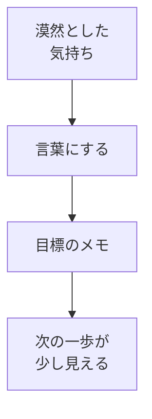
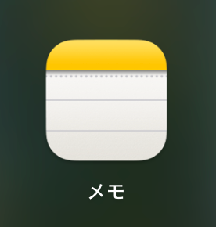

# 目標を整理する

## たとえ話

こんにちは。今日は、学びの土台となる「目標」をメモに残します。

新しいことを始めると、最初の数日は気持ちが続きます。でも1週間ほど経つと、手が止まる人は少なくありません。三日坊主と言われることもありますが、これは意志が弱いからではなく、**人にとって自然な反応**です。続かないのは、ほとんどの場合、気合いの問題ではなく**設計の問題**です。

AIやパソコンの操作より先に、ここを整えます。Rebuild AI Guild に来た理由を含めて、学びの方向をメモに残してみます。

## 今日の課題

Rebuild AI Guild に来た理由を含めて、学びの方向をメモに残す。

## このテーマで伸ばす力

**習慣力・整理力** — 漠然とした気持ちを、自分の言葉にして次の一歩につなげる力です。

## 学びの段階

今日の完了条件は **「できる」** です。「知った」で終わらせず、メモを書いて自分の言葉で読み返せるところまで進めます。

## なぜ大事か

## コラム：三日坊主は自然

> 何かを続けられないとき、「意志が弱い」と感じる人は多いです。しかし新しい行動が短期で止まるのは、人にとって自然な反応です。自分を責めるより、**続く仕組み**を作るほうが先です。今日の目標は、完璧な計画ではなく、小さくても続けられる設計の入口です。

第1章は、AIやパソコンの基礎より**先**にやる、いちばん大切な章です。続かないのは、ツールが難しいからではなく、**続く設計**が足りないことがほとんどです。習慣化は才能ではなく、低い目標・リマインダー・代替行動で設計します。

「なぜ学ぶのか」を言葉にしておくと、つまずいたときに戻る場所ができます。Rebuild AI Guild は、コードを一から書ける人を育てる場所ではありません。**作る力・判断する力・続ける力・整える力・相談する力・進める力**を育てる場所です。今日は、その土台の最初の一歩です。

## 読んで学ぶ

「目標」という言葉は、正解が1つあるように感じることがあります。ここでは難しく考えなくて大丈夫です。

メモには、次のようなことを書いてみます。全部でなくても、書けたところからで大丈夫です。

- **なぜ Rebuild AI Guild に来たか**（きっかけ・今の気持ち）
- **1年後に「できていてよかった」と思うこと**（ざっくりでよい）
- **近いうちに、小さく試したいこと**（短い時間でできる大きさ）

正しい目標がわからなくて止まる人は多いです。完璧な文章は不要です。箇条書きでも、口語でも、メモ書きでも大丈夫です。

**個人情報・機密情報の注意**：お客さまの名前・売上の具体的な数字など、仕事の機密は書かないでください。「記録を整理したい」くらいのざっくりした言葉で十分です。

### 図解



## 手順

Macの **メモ**（Notes／ノーツ）アプリに、学び用のノートを1つ作ります。画面下の Dock（ドック）からアイコンを押して開きます。



### ステップ0：メモを Dock から開く（初回だけ）

1. 画面下の **Dock**（アイコンが並ぶバー）を見る。
2. 上の画像と同じ **メモ** アイコンがあれば、**1回クリック**する。
3. 見つからないときは、Dockの **Launchpad**（ロケットの形）を開き、**メモ** をクリックする。
4. メモが起動したら、Dockのメモアイコンを **右クリック** → **オプション** → **Dockに追加** を選ぶ。次からワンクリックで開ける。
5. メモの左側で **新規メモ** を作り、先頭行に `Guild 学習メモ` と書く。このノートを、しばらくの学習メモの置き場にする。

### ステップ1：なぜ来たかを書く

**Guild 学習メモ** を開き、次の文をそのまま書き始めてください。

```text
Rebuild AI Guild に来た理由は、
```

ここで止まったら、次のどれかを続けてください。

- 「何から始めればいいかわからなかったから」
- 「一人だと続かなそうだったから」
- 「仕事の○○を整えたいから」（○○は自分の言葉で）

**わからないまま進まないチェック**：書くことが思いつかない → ここで止まって、この文だけ書ければOKです。今日はここまでで十分です。

### ステップ2：1年後のイメージを書く

次の質問に答える形で、メモに追記します。

```text
1年後にできていてよかったと思うことは、
```

例：

- お客さまの記録の探し方が決まっている
- 案内の文案を自分で直せる
- サービス一覧が1か所にまとまっている
- やりとりの記録をすぐ見つけられる

### ステップ3：近いうちに試すことを書く

はじめのうちに試すことを、**短い時間でできる大きさ**でメモに追記します。

```text
近いうちに試すことは、
```

例：

- 「毎日少しだけ、メモを開いて書く」
- 「案内の現状を紙に書き出す」

大きすぎる目標（「サイトを全部作る」など）は、今日は書かなくて大丈夫です。後の教材で小さく分けていきます。

### ステップ4：読み返す

書いたメモを声に出さなくても、目で追って読み返してください。

「これは自分の言葉か？」と感じたら完了です。直したいところがあれば、1か所だけ直して終わりにしてください。

## できたらOK

- 目標のメモが書けている（少しでもよい）
- 自分の言葉で読み返せる
- 仕事の機密情報を書いていない

## つまずいたら

**躓いたら戻る先**：なし（第1章の最初のテーマです）

| つまずき | 対処 |
|---|---|
| 正しい目標がわからない | 「今の気持ち」を書けばOK |
| 全部書けない | ステップ1だけで今日は終了 |
| 仕事とつながらない | 「記録・案内・一覧」など、困りごとから1つ選ぶ |
| 書くことが思いつかない | 「来た理由は、わからなかったから」だけでもOK |

## 問い

1年後に「できていてよかった」と思うことは、あなたの仕事では何でしょうか。  
今日書いたメモのうち、いちばんしっくりきた部分は、どこでしょうか。

---

## 進む

[この章の目次](README.md) ｜ [次：02 学習管理スプシをコピーする](02-学習管理スプシをコピーする.md) →
