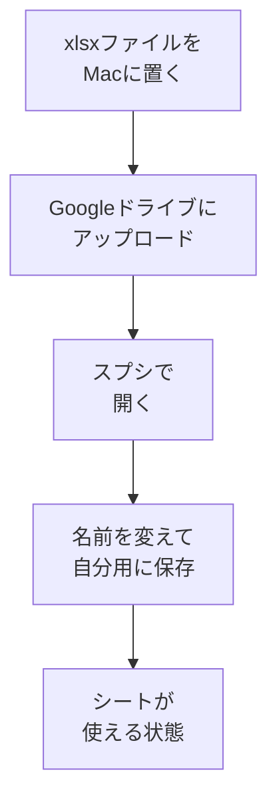

# 学習管理スプシをコピーする

## たとえ話

こんにちは。今日は、学びを続けるための「置き場所」を用意します。

まっさらなノートを前にすると、「何を書けばいいか」で手が止まりやすいです。けれど、見出しが決まったノートなら、中身を少しずつ入れていくだけで済みます。枠があるだけで、ゼロから考える負担はぐっと軽くなります。

記録の習慣も同じです。教材に付いているテンプレートを、自分の Googleドライブ（グーグルドライブ）に置きます。Googleスプレッドシート（スプシ）の学習管理テンプレを、自分のGoogleドライブに用意してみます。

## 今日の課題

Googleスプレッドシート（スプシ）の学習管理テンプレを、自分のGoogleドライブに用意する。

## このテーマで伸ばす力

**習慣力** — 学びを続けるための「置き場所」を作る力です。

## 学びの段階

完了条件は **「できる」** です。自分のGoogleドライブに学習管理スプレッドシートが1つあること。

## なぜ大事か

第1章は、AIやパソコンの基礎より**先**にやる、いちばん大切な章です。「なぜ学ぶか」「いつ学ぶか」を紙や頭の中だけに置くと、忘れます。

Googleスプレッドシート（スプシ）に置くと、**見返せる・直せる・続けられる**土台になります。習慣化は才能ではなく設計です。今日は、その設計の器を用意します。

## 読んで学ぶ

### テンプレートに入っているシート

| シート名（タブ） | 目的 |
|---|---|
| `01_習慣設計` | 目標・習慣ルール・3週間ライン |
| `02_週間時間割` | 学習できそうな時間の見える化（別案の主な置き場は `01_習慣設計`） |
| `03_日々の記録` | 今日やったこと、詰まったこと |
| `04_行動変容ワーク` | 必要なときだけ使う振り返り |

正本ファイルは **[ギルド学習管理シート.xlsx](../../assets/spreadsheet/ギルド学習管理シート.xlsx)** です。

**xlsxの入手方法**（GitHubで教材を見ている場合）：

1. 上のリンク（または [assets/spreadsheet/ギルド学習管理シート.xlsx](../../assets/spreadsheet/ギルド学習管理シート.xlsx)）を開く
2. 画面右上の **Download**（ダウンロード）をクリックする
3. ダウンロードフォルダに保存される

今日は **中身を書かなくてOK** です。次の教材から書き始めます。

### 図解



## 手順

### 準備：xlsxファイルをMacに置く

1. [ギルド学習管理シート.xlsx](../../assets/spreadsheet/ギルド学習管理シート.xlsx) をダウンロードする。GitHubではファイル名をクリック → **Download**。
2. ダウンロードフォルダにファイルがあることを確認する（Finder（ファインダー）→ ダウンロード）。

**Googleアカウントがまだない人**は、今日はアカウント作成まででOKです。スプシの用意は明日でも大丈夫です。

> **スクショ案内**：ダウンロードフォルダに `ギルド学習管理シート.xlsx` が見えている画面を撮っておくと、あとで戻りやすいです。

### ステップ1：Googleドライブを開く

1. ブラウザ（Safari（サファリ）やChrome（クローム））を開く。
2. アドレスバーに `https://drive.google.com` と入力し、Enter（エンター）を押す。
3. Google（グーグル）アカウントでログインする（未ログインの場合）。

> **スクショ案内**：Googleドライブのトップ画面。左上に **新規** ボタンが見えている状態。

### ステップ2：ファイルをアップロードする

1. Googleドライブ画面の **左上** の **新規**（または **＋新規**）ボタンをクリックする。
2. メニューから **ファイルのアップロード** を選ぶ。
3. ファイル選択画面で、**ダウンロード** フォルダを開く。
4. `ギルド学習管理シート.xlsx` を選び、**開く**（または **選択**）をクリックする。
5. 画面右下にアップロードの進行が出ます。完了するまで待つ。

> **スクショ案内**：アップロード中の進行表示、または完了後にファイル一覧に `ギルド学習管理シート.xlsx` が現れた画面。

### ステップ3：スプレッドシートとして開く

1. アップロードが終わると、ドライブのファイル一覧に `ギルド学習管理シート.xlsx` が現れます。
2. そのファイルを **ダブルクリック** する。
3. プレビュー画面が開いたら、画面上部の **Googleスプレッドシートで開く** をクリックする。
   - 英語表示の場合は **Open with Google Sheets** です。
4. 新しいタブでスプレッドシートが開けば成功です。

> **スクショ案内**：「Googleスプレッドシートで開く」ボタンが見えている画面。

### ステップ4：名前を変えて自分用にする

1. スプレッドシート左上のタイトル（ファイル名）をクリックする。
2. 次の名前に変える：

```text
Rebuild AI Guild 学習管理（自分の名前）
```

例：`Rebuild AI Guild 学習管理（山田）`

3. Enter（エンター）で確定する。

### ステップ5：シートを確認する

1. 画面 **左下** に、シート名のタブが並んでいます。
2. 次の4つがあるか確認する（名前は近い表記でもOK）：
   - `01_習慣設計`（目標・習慣ルール）
   - `02_週間時間割`（時間の見える化）
   - `03_日々の記録`（日報）
   - `04_行動変容ワーク`（必要なときだけ）
3. タブをクリックして、切り替えられることを確認する。

> タブ名に数字がついていても、上の4つが揃っていれば成功です。

### ステップ6：保存の確認

Googleスプレッドシート（スプシ）は **自動保存** です。「保存」ボタンを押す必要はありません。ドライブに戻ると、同じ名前のファイルが残っていればOKです。

**わからないまま進まないチェック**：

- 「Googleアカウントがない」→ 先にGmail（ジーメール）の作成が必要です。今日はここで止まって大丈夫です。
- 「Googleスプレッドシートで開くが出ない」→ ファイルを右クリック → **アプリで開く** → **Googleスプレッドシート**
- 「シートが1つしかない」→ xlsxが正しくアップロードされたか確認し、もう一度アップロードしてみる

## できたらOK

- 自分のGoogleドライブに学習管理スプレッドシートがある
- 4つのシートタブが見える
- タイトルを自分用の名前に変えた

## つまずいたら

**躓いたら戻る先**：

- [第02 学習管理スプシをコピーする](02-学習管理スプシをコピーする.md)（スプシの用意からやり直す）
- [第1章 01 目標を整理する](01-目標を整理する.md)（学びの方向をメモに戻る）

| つまずき | 対処 |
|---|---|
| ログインできない | Googleアカウントの作成から。今日は準備だけでもOK |
| アップロードが終わらない | 通信を確認し、少し待つ。失敗したらもう一度選ぶ |
| スプシで開けない | 右クリック → アプリで開く → Googleスプレッドシート |
| シートが足りない | 正しい xlsx か確認し、再アップロード。4タブ揃えばOK |
| Finderがわからない | [第3章：Macとファイルの基礎](../第03章-Macとファイル/)（任意）

## 問い

このスプレッドシートを、**いつ開く習慣**にするでしょうか。（例：朝のコーヒーの前、週末の少しだけの時間）

---

## 進む

← [前：01 目標を整理する](01-目標を整理する.md) ｜ [この章の目次](README.md) ｜ [次：03 目標をスプシに書く](03-目標をスプシに書く.md) →
