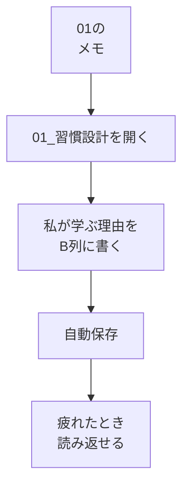

# 目標をスプシに書く

## たとえ話

こんにちは。今日は、前のテーマで書いた気持ちを、いつでも読み返せる場所に移します。

忙しい日が続くと、「なぜ始めたのか」が薄れて手が止まりやすいです。そんなとき、出発前に書いた短いメモがあれば、もう一度顔を上げて歩き出せます。立派な文章はいりません。自分に届く言葉で十分です。

学習管理スプシの **`01_習慣設計`** シートに「私が学ぶ理由」を書いてみます。

## 今日の課題

学習管理スプシの **`01_習慣設計`** シートの **「私が学ぶ理由」** 欄（B列）に、なぜ学ぶかを書く。

## このテーマで伸ばす力

**整理力** — 自分が何のために動いているかを言葉にする力です。

## 学びの段階

完了条件は **「できる」** です。`01_習慣設計` の「私が学ぶ理由」に自分の言葉が入っていること。

## なぜ大事か

第1章は、AIやパソコンの基礎より**先**にやる、いちばん大切な章です。続かないのは、ツールが難しいからではなく、**続く設計**が足りないことがほとんどです。

「サービス一覧を自分で直したい」「案内を整えたい」など、理由が見えると、短い学習時間も **仕事の一部** に感じられます。スプレッドシート（スプシ）に書いておくと、疲れた日にも読み返せます。

## 読んで学ぶ

### `01_習慣設計` に書く項目

テンプレートの **`01_習慣設計`** シートには、目標宣言のブロックがあります。

- **私が学ぶ理由**（今日はここだけ）
- 3か月後にできるようになりたいこと
- 作りたいもの
- 今いちばん不安なこと

**今日は「私が学ぶ理由」だけ** 書けばOKです。ほかの欄は、あとで足していきます。

**入力の場所**：B列の **自分の回答** に書きます。C列の記入例は参考用です。消さなくてOKです。

### 書き方のヒント

- 完璧な文章にしない
- 「〜したい」「〜が不安」でよい
- 下の例をそのまま使っても、自分の言葉に変えてもよい

例：

```text
予約メモやサービス案を、自分のPCで整理できるようになりたい
```

別の例：

```text
案内文を、自分で直せるようになりたい
```

**個人情報・機密情報の注意**：お客さまの名前・具体的な数字などは書かないでください。

### 図解



## 手順

### ステップ1：スプレッドシートを開く

1. ブラウザで `https://drive.google.com` を開く。
2. `Rebuild AI Guild 学習管理（自分の名前）` のファイルをダブルクリックして開く。

### ステップ2：`01_習慣設計` を開く

1. 画面 **左下** のタブから **`01_習慣設計`**（または **習慣設計**）をクリックする。
2. 下にスクロールし、**目標宣言｜自分の回答欄を埋める** のブロックを探す。

> **スクショ案内**：左下に `01_習慣設計` タブが見え、目標宣言ブロックが見えている画面。

### ステップ3：「私が学ぶ理由」に書く

1. **私が学ぶ理由** の行の、**B列（自分の回答）** のセルをクリックする。
2. キーボードで、なぜ学ぶかを書いてみる。
3. Enter（エンター）を押すか、別のセルをクリックすると入力が確定する（自動保存）。

> **スクショ案内**：「私が学ぶ理由」のB列に書き込んだ状態（個人情報は写さないか、ぼかす）。

**わからないまま進まないチェック**：

- 「何を書けばいいかわからない」→ 「Rebuildに来たのは、〇〇がしたいから」で始めてみる
- 「01のメモがない」→ 今の気持ちをそのまま書く
- 「セルが小さくて見えない」→ 列の境界線をドラッグして広げる

### ステップ4：読み返す

1. 書いたセルをもう一度クリックし、目で読み返す。
2. 「自分の言葉」に感じられたら今日は完了です。

## できたらOK

- `01_習慣設計` を開いた
- 「私が学ぶ理由」のB列に自分の言葉が入っている
- 読み返した

## つまずいたら

**躓いたら戻る先**：

- [01 目標を整理する](01-目標を整理する.md)（紙やメモアプリの目標メモに戻る）
- [02 学習管理スプシをコピーする](02-学習管理スプシをコピーする.md)（スプシの用意からやり直す）

| つまずき | 対処 |
|---|---|
| スプシが見つからない | Googleドライブで「Rebuild AI Guild」と検索 |
| 習慣設計シートがない | [02](02-学習管理スプシをコピーする.md)の4タブ確認に戻る |
| 言葉が出てこない | 01の「来た理由」だけ写してもOK。あとで直せる |
| 欄がわからない | 「私が学ぶ理由」と書いてある行のB列を探す |

## 問い

1週間後、同じ行を読み返したとき、**まだしっくり来るでしょうか。** 違う気持ちになっていたら、直して大丈夫です。

---

## 進む

← [前：02 学習管理スプシをコピーする](02-学習管理スプシをコピーする.md) ｜ [この章の目次](README.md) ｜ [次：04 時間を見える化する](04-時間を見える化する.md) →
