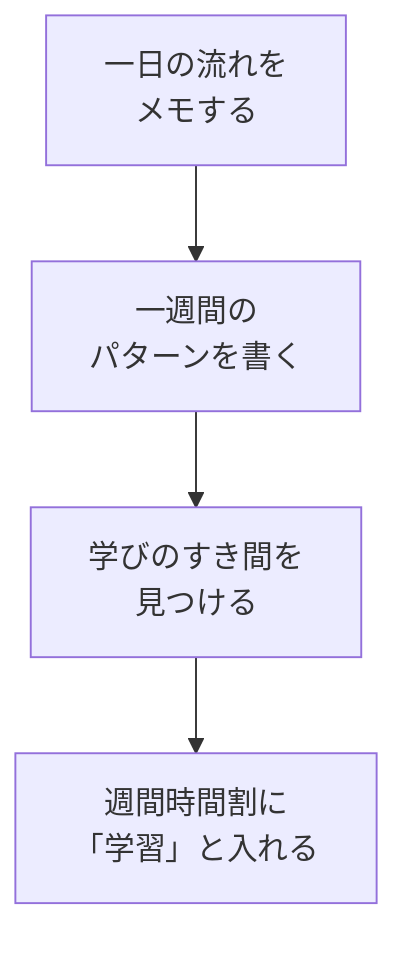

# 時間を見える化する

## たとえ話

> 同じ広さの部屋でも、物が床に散らばっていると「もう置く場所がない」と感じます。一度すべてを棚に並べ直すと、空いている隙間がいくつもあったと気づくことがあります。狭かったのは部屋ではなく、何がどこにあるか見えていなかっただけです。
>
> 一日の時間も、これによく似ています。「時間がない」と感じるとき、本当に一分も空いていないとは限りません。今日は、一日と一週間の流れを書き出し、学びに使えそうなすき間を見つけます。見えてはじめて、スプレッドシートの週間時間割にも置けるようになります。

## 今日の課題

一日と一週間の過ごし方をざっくり書き出し、**学びに使えそうな時間**を見つける。  
見つけた時間を、学習管理スプシの **週間時間割** に入れる。

**15分版**：ステップ1〜4まで（メモで学びのすき間を1つ見つける）。週間時間割への入力は**別日**でもOKです。

**標準版（30分）**：ステップ5まで。週間時間割には**1マスだけ**入れれば完了です。

## このテーマで伸ばす力

**整理力** — やっていることを書き出し、次に取る時間の候補を見つける力です。

## 学びの段階

今日の完了条件は **「できる」** です。完璧なスケジュール表は作りません。書き出して、学びの時間を週間時間割に入れたところでOKです。

## なぜ大事か

「時間がない」は感覚であることが多いです。書き出すと、**削れる時間**や**短くできる時間**が見つかることがあります。

第1章のはじめで「なぜ学ぶか」を書きました。今日は、その学びを**いつ入れるか**の材料を集めます。紙やメモで一度眺めてから、スプレッドシートに移すと、あとから見返しやすくなります。

## コラム：ダラダラモードに置かない

> ソファでスマホを見ているとき、急に「さあ学習」と始めるのは難しいです。新しい習慣は、**すでに動いている行動の前後**にくっつけると続きやすくなります。
>
> 例：**PCを開いた直後**、仕事を始める前、コーヒーを淹れたあと。ダラダラしがちな時間帯そのものを責めるより、「その直前か直後に5分だけ」と決めておくほうが現実的です。

## 読んで学ぶ

時間の見える化は、分単位の精密な記録ではありません。**ブロック**で書きます。

- 朝：準備・移動
- 昼：仕事の中心の時間
- 夕方：事務・片づけ
- 夜：休息

働く日と休みの日でパターンが違うことは多いです。「いつもと違う日」は無理に一般化しなくて大丈夫です。**いちばん多いパターン**を書けばOKです。

**個人情報の注意**：お客さまの名前・具体的な予定の詳細は書かないでください。

### 週間時間割のイメージ

学習管理スプシの **週間時間割** タブ（テンプレートによっては **02_週間時間割** と表示されます）は、30分ごとのマスに「睡眠」「仕事」「学習」などと書き込む表です。学びの時間は、マスに **学習** と入力します。

### 図解



## 手順

用意するもの：紙とペン（またはメモアプリ）、学習管理スプレッドシート

### ステップ1：昨日の一日を思い出して書く（5分）

メモを開き、昨日やったことを、思い出せる範囲で書いてみます。細かくなくて大丈夫です。

例：

- 朝の準備と移動
- 仕事の中心の時間
- 帰宅後の片づけ
- 夜の休息

「全然時間がない」と感じるが書けない → まず **いちばん忙しかった曜日** を1つだけ書いてください（例：「土曜は対応が続く」）。それで先に進めます。

### ステップ2：一日のブロックを書く（5分）

典型的な1日を、大きなブロックに分けて書きます。時刻はざっくりでよいです。

```text
【一日の過ごし方（たたき台）】
・朝（　時ごろ〜　時ごろ）：
・昼（　時ごろ〜　時ごろ）：
・夕方（　時ごろ〜　時ごろ）：
・夜（　時ごろ〜　時ごろ）：
```

空欄は「だいたい」で埋めてください。わからないブロックは「バラバラ」と書いてもOKです。

### ステップ3：一週間のパターンを書く（5分）

曜日ごとに、ステップ2と同じくらいのざっくりさで書きます。全部埋めなくて大丈夫です。**違いが大きい曜日だけ**でもOKです。

```text
【一週間の過ごし方（たたき台）】
月：
火：
水：
木：
金：
土：
日：
```

### ステップ4：学びの時間候補を見つける（5分）

メモを見返し、学びに使えそうな時間を書いてみます。

```text
学びに使えそうな時間は、
```

候補の例：

- 仕事を始める前の5分
- PCを開いた直後の5分
- 寝る前5分
- 休みの日の朝

「毎日は無理」でも大丈夫です。**週に何回なら取れそうか**を横に書いておくと、次の教材につながります。

### ステップ5：週間時間割に入れる（10分）

1. ブラウザで [Googleドライブ](https://drive.google.com) を開き、**Rebuild AI Guild 学習管理** スプレッドシートを開く。
2. 画面 **左下** のタブから **週間時間割**（または **02_週間時間割**）をクリックする。
3. 右側の **時間割カテゴリ・色ルール** を見て、**学習** の入力方法を確認する。
4. ステップ4で見つけた時間帯に合う **マス** を探す（縦が時刻、横が曜日）。
5. そのマスをクリックし、キーボードで **学習** と入力する。
6. 学びに使えそうな時間を、**1枠以上** 入れる。15分なら隣のマスにも続けて「学習」と書いてよいです。

> **スクショ案内**：週間時間割に「学習」と書き込んだマスが見えている画面（個人の予定が写る場合は共有前に確認）。

### ステップ6（余力があれば）：ダラダラしがちな時間をメモする（任意）

メモに、だらだらしやすい時間帯を1行書きます。  
その **直前か直後** に、短い学習を置けるか考えてみてください（例：「PC起動直後に教材を開く」）。

## できたらOK

- [ ] 一日・一週間の過ごし方のたたき台が書けている
- [ ] 学びに使えそうな時間を見つけている
- [ ] 週間時間割に「学習」が1枠以上入っている
- [ ] お客さまの名前などの個人情報を書いていない

## つまずいたら

**躓いたら戻る先**：[03 目標をスプシに書く](./03-目標をスプシに書く.md)（なぜ学ぶかがぼやけたとき）／[02 学習管理スプシをコピーする](./02-学習管理スプシをコピーする.md)（スプシがまだないとき）

| つまずき | 対処 |
|---|---|
| 生活を晒す感じがして書きにくい | 仕事のブロックだけ書く。詳細は書かない |
| 毎日バラバラで一般化できない | いちばん多いパターンの日だけ書く |
| 学びの候補が見つからない | 「寝る前5分」か「PCを開いた直後5分」を仮で1つ書く |
| 週間時間割のマスが多すぎる | 今週いちばん現実的な曜日の1枠だけ入れる |

## 今日の成果物

- **時間の見える化メモ**（一日・一週間のたたき台 ＋ 学びの時間候補）
- **週間時間割** に入れた「学習」のマス

## 問い

学びに使えそうな時間は、あなたの1週間のどこにありそうでしょうか。  
「時間がない」と感じていた時間帯を書き出してみて、見え方は少し変わりましたか。

## 進む

← [03 目標をスプシに書く](./03-目標をスプシに書く.md) ｜ [この章の目次](./README.md) ｜ [05 毎日1アクションとトリガー](./05-毎日1アクションとトリガー.md) →
