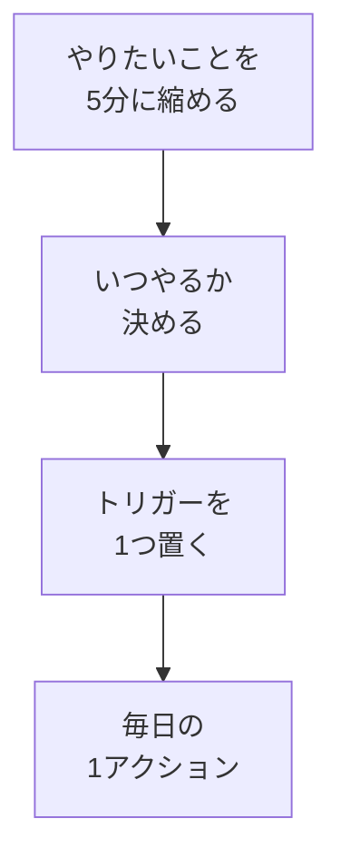

# 毎日1アクションとトリガー

## たとえ話

> 毎日コップ一杯の水をやれば育つ植物があります。手間としてはほんの数十秒で、特別な道具もいりません。それでも枯らしてしまう人は少なくありません。やる気がないからではなく、「いつ水をやるか」が決まっていないからです。
>
> 学びを続けることも、この水やりとよく似ています。大きな決意より、**小さくて毎日できる行動**を**いつやるか**まで決めておくほうが、長持ちしやすいです。今日は、5分の1アクションと、それを思い出すトリガーを決めます。

## 今日の課題

毎日必ずやる **1アクション** を1つ決め、**いつ・どう思い出すか**（トリガー）まで書く。

## このテーマで伸ばす力

**習慣力・整理力** — 大きな目標を、今日から実行できる1アクションに落とす力です。

## 学びの段階

今日の完了条件は **「できる」** です。宣言文を書き、**今日から実行できる大きさか**を自分で確認したところまで進めます。

## なぜ大事か

「1日1時間学ぶ」と決めて続かない人は多いです。最初から大きすぎただけのことがほとんどです。

Rebuild AI Guild の第1章では、**5分でできること**を軸にします。5分なら、前の教材で見つけたすき間に入れやすくなります。

## コラム：忘れない仕組み

> 習慣化の第一歩は、やる気より **思い出すこと** です。スマホのリマインダー（アラーム）、スプシのブックマーク、机の上のメモなど、**見えるトリガー**を1つ置きます。
>
> 行動までのステップを減らすほど、続きやすくなります。「教材フォルダを開く → 今日のファイルを探す → 読む」より、「ブックマークを1回押して、見出しだけ読む」のほうが、忘れにくいです。

## 読んで学ぶ

「毎日やる1アクション」とは、次の条件を満たす **1つだけ** の行動です。

- **5分以内**で終わる（または「開くだけ」「1行書くだけ」でもよい）
- **場所や道具が決まっている**（例：スマホのメモ、学習管理スプシ）
- **やったかどうかがはっきりわかる**（例：「メモを開いた」「1行書いた」）

例：

- 「仕事を始める前の5分、学習管理スプシに1行書く」
- 「PCを開いた直後、教材の見出しだけ読む」
- 「寝る前5分、明日の5分でやることを1行書く」

**トリガー**とは、「この合図が出たらやる」と決めたきっかけです。

- 時刻のリマインダー（例：毎朝8:00）
- すでにある行動の直後（例：コーヒーを淹れたあと）
- 目に入るもの（例：スプシをホーム画面に置く）

### 図解



## 手順

### ステップ1：5分でできる学びの行動を書く（5分）

メモを開き、5分でできそうな学びの行動を、思いつく範囲で書いてみます。

```text
【5分でできる学びの行動（候補）】
・
・
```

候補のヒント：

- 教材を開く
- 1行メモを書く
- 末尾の問いに1行答える
- 昨日の困りごとを1行書く

完璧な学習内容は不要です。**続けられそうか**を優先してください。

### ステップ2：1つだけ選ぶ（5分）

書いた候補のうち、**いちばん続けられそうなもの**を1つに決めます。

迷ったら、次の基準で選びます。

- 道具を用意しなくてよい
- 移動中でもできそう
- 失敗しても困らない

「毎日は無理」と感じる → 週に数回でもよいです。ただし **いつやるか** は必ず1つ決めてください（例：「月・水・金の寝る前5分」）。

### ステップ3：宣言文を1文で書く（5分）

次の型に当てはめて、**1文**書きます。

```text
【毎日やる1アクションの宣言】
（いつ）に（何を5分やる）。
```

例：

- 「毎晩、寝る前5分に、Rebuildの教材を開いて1行メモする。」
- 「働く日の朝、PCを開いた直後5分、学習管理スプシを開く。」
- 「火・木・土の仕事のあと5分、困りごとを1行書く。」

### ステップ4：トリガーを1つ決める（5分）

宣言文を忘れないために、次から **1つ** 選び、すぐ設定または配置します。

| トリガーの種類 | やること |
|---|---|
| リマインダー | スマホの時計アプリで、宣言の時刻に通知を1つ作る |
| 既存の行動 | 「○○の直後にやる」とメモに追記する（例：PC起動直後） |
| 見える場所 | スプシのURLをブラウザのブックマークバーに置く |

```text
【トリガー】
種類：
具体的な設定：
```

### ステップ5：大きすぎないか確認する（5分）

宣言文を読み、次をチェックします。

- [ ] 5分（またはそれ以下）で終わる言い方になっている
- [ ] 「いつ」が具体的（「いつか」ではない）
- [ ] トリガーが1つ決まっている
- [ ] 今日から始められる

1つでも×なら、**半分の大きさ**に直します。

- 「1時間教材を読む」→「教材を開いて見出しだけ読む」
- 「記録を全部整理する」→「記録について1行メモする」

### ステップ6：スプシの習慣設計に書く（5分）

1. 学習管理スプレッドシートを開く。
2. 左下タブの **習慣設計**（または **01_習慣設計**）をクリックする。
3. **習慣化の4法則** の **1. はっきりさせる** の行を探す。
4. **自分のルール** のセルに、ステップ3の宣言文を書く。
5. Enter または別のセルをクリックして確定する（自動保存）。

> **スクショ案内**：「はっきりさせる」の自分のルールに宣言文が入った画面。

## できたらOK

- [ ] 毎日やる1アクションの**宣言文が1文**書けている
- [ ] 5分以内・いつやるかが書けている
- [ ] トリガーを1つ決め、設定または配置した
- [ ] 習慣設計シートの「はっきりさせる」に宣言を書いた
- [ ] 今日から実行できる大きさだと自分で確認した

## つまずいたら

**躓いたら戻る先**：[04 時間を見える化する](./04-時間を見える化する.md)（時間の候補が見つからないとき）

| つまずき | 対処 |
|---|---|
| 1時間学習を宣言してしまった | ステップ5で5分に縮小する |
| 毎日無理 | 週に数回＋曜日を宣言に書く |
| 何をすればいいかわからない | 「教材を開く」だけで宣言する |
| リマインダーが怖い | 既存の行動の直後（PC起動直後など）をトリガーにする |

## 今日の成果物

- **毎日やる1アクションの宣言**（1文）
- **トリガーのメモ**（リマインダー・既存行動・ブックマークのどれか）
- 習慣設計シートの「はっきりさせる」1行

## 問い

毎日5分なら、あなたの生活のなかで何なら続けられそうでしょうか。  
今日決めたトリガーは、忘れそうな自分にとって現実的でしょうか。

## 進む

← [04 時間を見える化する](./04-時間を見える化する.md) ｜ [この章の目次](./README.md) ｜ [06 別案と3段階の最低ライン](./06-別案と3段階の最低ライン.md) →
