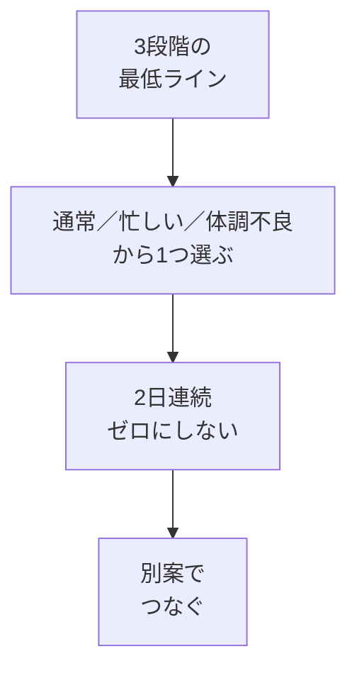

# 別案と3段階の最低ライン

## たとえ話

> 雨の日のために傘を一本かばんに入れておく人は、急な雨でもあわてません。傘があるから雨が降らなくなるわけではありません。降ったときにずぶ濡れにならずに済むのです。備えとは、悪いことを防ぐためではなく、起きても立て直せるようにしておくことです。
>
> 学びの計画も、これと同じです。予定していた時間に急な用事が入るのは、誰にでも起きる日常で、失敗ではありません。今日は、通常・忙しい・体調不良の3段階の最低ラインと、崩れたときの別案をスプシに書きます。

## 今日の課題

**通常・忙しい日・体調不良**の3段階の最低ラインを決め、**2日連続で完全ゼロにしない**ルールを書く。  
あわせて、**リカバリールール**に崩れたときの別案を1行書く。

## このテーマで伸ばす力

**続ける力** — 予定が狂っても、ゼロにしない選択ができる力です。

## 学びの段階

今日の完了条件は **「できる」** です。3段階の最低ラインと、リカバリールールへの別案1行が書けたところでOKです。

## なぜ大事か

「今日はダメだった」で終わると、習慣は途切れやすくなります。  
**5分だけ・開くだけ・1行メモ** など、縮小版をあらかじめ決めておくと、続きやすくなります。

テンプレートの習慣設計シートにも、「2日連続で完全に離れない」と書いてあります。今日は、それを**あなたの言葉**で埋めます。

## 読んで学ぶ

### 3段階の最低ライン

| 区分 | 行動の目安 |
|---|---|
| **通常** | 前の教材で決めた5分の1アクションをやる |
| **忙しい日** | 学習管理スプシを開くだけ／1行メモする |
| **体調不良** | 目標や宣言を読むだけ／教材を開かずに休む宣言を1行書く |

**絶対ライン**：**2日連続で完全ゼロにしない**。1日サボっても、翌日は最低ライン（忙しい日でも体調不良ラインでもよい）で戻る。

### 別案の例

| 元の計画 | 崩れた理由（例） | 別案 |
|---|---|---|
| 火 21:00 学習 | 残業で遅くなった | 寝る前5分、目標シートを読むだけ |
| 日 10:00 学習 | 家族の用事 | 月曜朝、教材を開くだけ |
| 夜の学習枠 | 対応が長引いた | 翌日ランチ後10分、1行メモ |

### 別案のルール

1. **ゼロにしない** — 何か1つは残す
2. **短くてよい** — 5分、1行メモ、読むだけでもOK
3. **責めない** — 別案を実行した自分を責めない

### 図解



## 手順

### ステップ1：3段階の最低ラインを書く（10分）

1. 学習管理スプレッドシートを開く。
2. 左下タブの **習慣設計**（または **01_習慣設計**）をクリックする。
3. **習慣化の4法則** の **3. 簡単にする** の **自分のルール** セルをクリックする。
4. 次の形で、あなたの言葉で書く。

```text
【通常】（前の教材の1アクション）
【忙しい日】（縮小版）
【体調不良】（いちばん小さい版）
【絶対ライン】2日連続ゼロにしない。翌日は上のどれかで戻る。
```

例：

```text
【通常】寝る前5分、教材を開いて1行メモ
【忙しい日】スプシを開いて1行だけ書く
【体調不良】`01_習慣設計` の学ぶ理由を読むだけ
【絶対ライン】2日連続ゼロにしない。翌日は読むだけでも戻る
```

### ステップ2：リカバリールールを埋める（5分）

同じ **習慣設計** シートの **リカバリールール** を下にスクロールして開きます。

次の場面のうち、**いま自分に近いもの** を選び、**自分のルール** に1行ずつ書きます（全部でなくてOK）。

| 場面 | 書くことの例 |
|---|---|
| 急な予定が入った | 夜に1行だけ記録する |
| 疲れている | 休憩を優先し、翌日は開くだけで戻る |
| 挫折しそう | 目標宣言を読み返すだけでOK |

### ステップ3：週間時間割を開く（2分）

1. 左下タブの **週間時間割**（または **02_週間時間割**）をクリックする。
2. 前の教材で入れた **学習** のマスを確認する。

### ステップ4：別案を書く（10分）

**週間時間割の見出しは変えません。** 別案は **`01_習慣設計`** の **リカバリールール** に書くのがおすすめです。

1. `01_習慣設計` を開き、**リカバリールール** を下にスクロールする。
2. **急な予定が入った** など、自分に近い場面の **自分のルール** に1行書く。
3. 例：「23:00に5分、目標を読むだけ」「昼休みにスプシを開くだけ」

**いちばん大事な学習枠が1つだけ** なら、別案も1行でOKです。複数枠がある人は、余力があれば行を足してください。

別案が思いつかない → 「5分だけスプシを開く」で固定してOKです。

### ステップ5：声に出して確認する（3分）

1. 3段階の最低ラインを読み上げる。
2. 別案を1つ読み上げる。
3. 「これならできそう」と感じるか確認する。無理なら、もっと短くする。

## できたらOK

- [ ] 習慣設計シートに3段階の最低ラインが書いてある
- [ ] 「2日連続ゼロにしない」ルールが書いてある
- [ ] リカバリールールに自分の言葉が1行以上ある
- [ ] リカバリールールに別案または自分のルールが1行以上ある
- [ ] 別案は「完全ゼロ」ではなく、短い行動になっている

## つまずいたら

**躓いたら戻る先**：[05 毎日1アクションとトリガー](./05-毎日1アクションとトリガー.md)（1アクションがまだ決まっていないとき）

| つまずき | 対処 |
|---|---|
| 3段階すべて考えられない | まず「忙しい日」だけ書く。体調不良は「読むだけ」で固定 |
| 別案も実行できなかった | 翌日は体調不良ラインで戻る。責めない |
| 学習枠が1つもない | [04 時間を見える化する](./04-時間を見える化する.md) に戻り、1枠入れてから再開 |

## 今日の成果物

- 習慣設計シートの **3段階の最低ライン** とリカバリールール（別案含む）

## 問い

過去1週間で計画が崩れたとき、実際はどうしていましたか。  
その経験を、今日書いた別案や最低ラインに活かせそうでしょうか。

## 進む

← [05 毎日1アクションとトリガー](./05-毎日1アクションとトリガー.md) ｜ [この章の目次](./README.md) ｜ [07 スタート3週間ルール](./07-スタート3週間ルール.md) →
