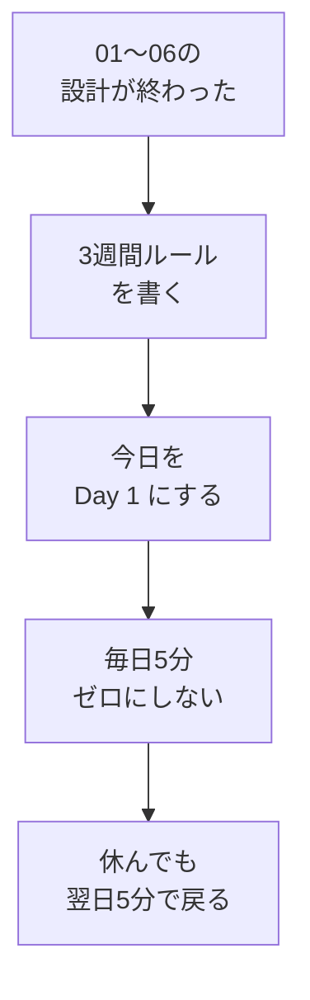

# スタート3週間ルール——1日5分・完全ゼロにしない

## たとえ話

こんにちは。今日は、これまで決めてきた設計を動かし始める**スタート3週間ルール**を書きます。

新しい習慣を始めると、最初の数週間は消えやすい小さな炎のようです。風が吹けばすぐ弱くなります。だから大きな薪を一度にくべるより、**短くても火を絶やさない**ほうが先です。

根性で燃やしつづけるのではなく、忙しい日でも**接点だけ残す**ルールを決めます。今日から21日間のカウントを始めます。

## 今日の課題

**3週間ルール**を書き、今日を **Day 1** としてカウントを始める。あわせて、ルールの意味を4択チェックで確認する。

## このテーマで伸ばす力

**習慣力** — 最初の21日間を短く区切り、休んでも戻れるルールを自分で決める力です。

## 学びの段階

今日は **理解（知った・わかった）** と **実践（できる）** の両方です。

- 4択チェックでルールの意味を確認する
- 3週間ルールを書き、今日からカウントを始められる

## なぜ大事か

テーマ01〜06で、目標・時間・1アクション・別案・最低ラインまで**設計**は終わりました。ここが第1章の**分岐点**です。ここから21日間、動きを記録していきます。

新しいことを始めると、体や頭が「いつもと違う」と感じることがあります。これは自然な反応です。悪いことではありません。

スタート3週間ルールは、気合いだけに頼りません。次の2つをセットにします。

1. **1日5分** — テーマ05で決めた1アクションと同じくらいの大きさ
2. **完全ゼロにしない** — 忙しい日は最低ライン（開くだけ・1行）で接点を残す

**休んだら終わりではありません。** 休んだ翌日に5分だけ戻る、とルールに書いておきます。

できればの3ヶ月目標は、21日後に見直してもよいです。今日は3週間だけに絞っても、この教材は完了です。

### 図解



## 読んで学ぶ

### スタート3週間ルールとは

最初の**21日間**は、次を自分との約束にします。

- 毎日（または決めた曜日）**5分だけ**やる
- **成果の大小は問わない**（開いた・1行書いた・読んだだけでもOK）
- **1日休んでも終わりにしない**。翌日5分で戻る

例：「3週間、仕事を始める前5分だけメモを開く。休んだ日は翌朝5分で戻る。」  
例：「3週間、仕事のあと5分だけ案内のメモを1行。休んだ日は翌日の合間5分で戻る。」

テーマ06の**3段階の最低ライン**とつながります。通常・忙しい日・体調不良のどれを使っても、**2日連続で完全ゼロにしない**のが絶対ラインです。

### 3ヶ月は「できれば」（任意）

3ヶ月の目標は、3週間が終わったあと見直してもよいです。今日は「こうなっていたらうれしい」くらいで書きます。

**わからないまま進まないチェック**：「3ヶ月は不安」→ 今日は**3週間ルールだけ**書いて完了にしてください。3ヶ月の欄は空欄でもOKです。

## コラム：根性より設計

> 続かないのは、意志が弱いからだけではありません。最初の21日間は、大きな成果をねらうより、**短くても接点を残す**設計が先です。テーマ06の別案と最低ラインを使えば、崩れた日もゼロにしにくくなります。

## 手順

### ステップ1：3週間ルールを書く

学習管理スプレッドシート（スプシ）の **`01_習慣設計`** シート、またはメモに、次の見出しと1行目を書きます。

```text
【スタート3週間ルール（今日から　月　日〜　月　日）】
21日間、（いつ）に（5分の行動）をする。完全ゼロにしない。休んだ日は翌日5分で戻る。
```

日付は今日から数えて21日後までをメモに書いておくと、終わりが見えます（カレンダーアプリで確認してもよいです）。

テーマ05の「毎日やる1アクションの宣言」と**同じ行動**で構いません。

### ステップ2：3ヶ月の目標を書く（任意）

余力があれば、次を1行書きます。

```text
【できれば3ヶ月の目標】
3ヶ月後には、
```

不安なら「3週間が終わってから書き直す」とメモに書いて、空欄のまま進んでもOKです。

### ステップ3：今日からカウント開始

今日の5分を、ルールどおり実行してください。  
実行できたら、スプシの **`03_日々の記録`** で今日の日付の行に記入します。

- **E列**：学習時間（分）（例：`5`）
- **F列**：今日のふりかえり・明日の一歩（例：`Day 1 スタート`）
- **G列**：詰まったこと（なければ `なし`）

今日の日付の行が見つからない場合は、次の手順を試してください。

1. タブ **`01_習慣設計`** を開く
2. 上の方にある **開始日**（スタート日）のセルを探し、**今日の日付**を入力する
3. もう一度 **`03_日々の記録`** を開き、今日の行を探す

それでも見つからないときは、F列に `Day 1` とだけ書いても今日の完了とします。できなくても、明日5分で戻ればOKです。

## 4択チェック

> 答えは別ページです。わからなくても、先に自分の理由を一行書いてから、答え合わせに進んでください。

**問1.** スタート3週間ルールで、いちばん大事なのはどれですか？

- A. 1日1時間は必ず学ぶ
- B. 最初の21日間は、短くても完全ゼロにしない
- C. 休んだらルールを最初からやり直す
- D. 3週間で完璧な成果を出す

答え合わせはこちら：  
[答えを見る](../../答え/第01章-明確な目標と習慣/07-スタート3週間ルール-答え.md)

## できたらOK

- 3週間ルールが1行以上書けている（開始日・終了日の目安つき）
- 4択チェックに自分で答えた
- 今日を Day 1 としてカウントを開始できた（または明日5分で戻ると決めた）

## つまずいたら

**躓いたら戻る先**：[05 毎日1アクションとトリガー](05-毎日1アクションとトリガー.md)（5分の行動が大きすぎるとき）｜[06 別案と3段階の最低ライン](06-別案と3段階の最低ライン.md)（崩れた日の戻り方）

| つまずき | 対処 |
|---|---|
| 休んだら終わりだと思う | ルールに「翌日5分で戻る」を必ず書く |
| 体が拒否する・やりたくない | 自然な反応。5分を「開くだけ」に縮小 |
| 3ヶ月が重い | 3週間だけに絞る。3ヶ月は空欄OK |
| 根性が足りないと感じる | テーマ06の別案・最低ラインを見る |

## 問い

3週間、完全ゼロにしない5分だけ続けたら、あなたの仕事や学びで何が変わりそうでしょうか。  
休んでしまった日に、自分にどんな言葉をかければ戻りやすくなりそうでしょうか。

---

## 進む

← [06 別案と3段階の最低ライン](06-別案と3段階の最低ライン.md) ｜ [この章の目次](README.md) ｜ [答え（任意）](../../答え/第01章-明確な目標と習慣/07-スタート3週間ルール-答え.md) ｜ [08 日報・週報のはじめ](08-日報・週報のはじめ.md) →
