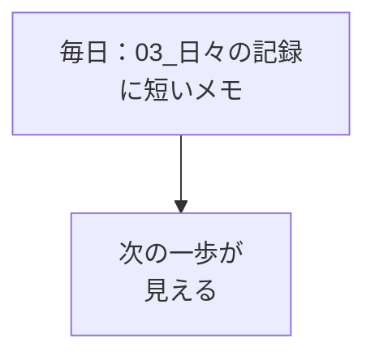

# 日報のはじめ

## たとえ話

こんにちは。今日は、学習管理スプシに**日報**を書き始めます。

旅先で毎日少しずつ写真を撮っておく人は、帰ってから振り返れます。何も残さないと、楽しかった日々がぼんやりした記憶のままになりやすいです。

学びの日々も同じです。長く書く必要はありません。短いメモくらいの軽さで十分です。残しておくと、次の一歩が自然と見えてきます。

## 今日の課題

学習管理スプシの **`03_日々の記録`** に今日の日報を書く。

## このテーマで伸ばす力

**整える力** — 自分の学びを短く記録し、次を小さく決める力です。

## 学びの段階

完了条件は **「できる」** — **`03_日々の記録`** に今日の記録が1行あること。

## なぜ大事か

「知った」「できた」「まだわからない」——学びの段階を言葉にすると、次に何をすればいいかが見えます。

日報は**その日の接点**です。完璧な日記ではありません。テーマ07で始めた21日間のカウントとつながる、軽い記録です。

書けなかった日があっても、翌日また1行書けば戻れます。完全ゼロにしない、という第1章の設計と同じです。

### 日報に書く型（ライト版）

次のテーマを、書けたところからで大丈夫です。

- **今日やったこと**（教材名でもOK）
- **詰まったこと**（なければ「なし」）
- **明日5分だけやること**

### 図解



## 手順

### 1. `03_日々の記録` を開く

1. 学習管理スプレッドシートを開く。
2. 画面左下のタブ **`03_日々の記録`** をクリックする。

### 2. 今日の日報を書く

1. **A列が今日の日付** の行を探す。
2. 次の列に書く（1セルにまとめてもOK）。

| 列 | 内容 |
|---|---|
| E | 学習時間（分）（例：`5`） |
| F | 今日のふりかえり・明日の一歩 |
| G | 詰まったこと（なければ `なし`） |

**例（F列）：**

```text
第1章 07 スタート3週間ルール、Day 1 を記録した
```

**別の例：**

```text
週間時間割を見直した。別案は明日試す
```

> **スクショ案内**：`03_日々の記録` に今日の行を書いた状態。

**今日の日付の行がない場合**：`01_習慣設計` の **開始日** を今日に合わせてから、もう一度開いてください。

## わからないまま進まないチェック

- 「詰まったことが恥ずかしい」→ ぼかして書いてもよい。「別案が難しかった」くらいで十分
- 「長く書けない」→ 1セルに短いメモだけでも完了

## できたらOK

- `03_日々の記録` に今日の記録がある
- 短いメモになっている

## つまずいたら

**躓いたら戻る先**：[02 学習管理スプシをコピーする](02-学習管理スプシをコピーする.md)（スプシがまだないとき）｜[07 スタート3週間ルール](07-スタート3週間ルール.md)（21日ルールの確認）

| つまずき | 対処 |
|---|---|
| 何を書けばいいかわからない | 例文をそのままコピーして、日付だけ変える |
| シートが見つからない | 左下タブを左右にスクロールして **`03_日々の記録`** を探す |
| 第1章を今日まとめて進めた | 日報1行だけで完了 |

## 問い

日報の「明日5分だけやること」は、**本当に明日やれそう**でしょうか。大きすぎたら、今すぐ1行短くしてください。

---

## 進む

← [07 スタート3週間ルール](07-スタート3週間ルール.md) ｜ [この章の目次](README.md) ｜ [09 うまくいかないとき考える](09-うまくいかないとき考える.md) →
