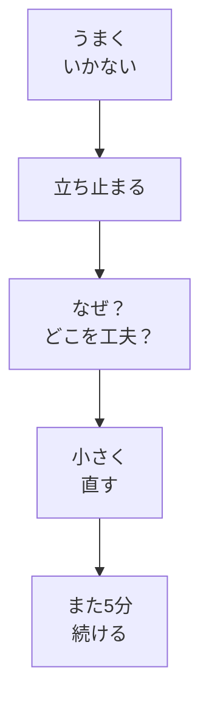

# うまくいかないとき考える

## たとえ話

こんにちは。今日は、うまくいかなかったときに**立ち止まって考える**入り口を作ります。

同じ道で何度もつまずく人と、一度で避けられるようになる人がいます。その差は、転んだあと「何に足を取られたか」を一度だけ振り返るかどうかにあることが多いです。

学びも同じです。うまくいかなかったときに「自分には向いていない」と決めつけるか、「何が違ったか」を一行だけ書き留めるか。今日は、失敗をなくす方法ではなく、**自分を責めずに戻る**ための問いかけを決めます。

## 今日の課題

うまくいかないときに**自分に問う言葉**を決め、振り返りメモを書く（スプシの日々の記録でも、紙のメモでもよい）。

## このテーマで伸ばす力

**判断する力** — 「なぜうまくいかないか」「どこを変えられそうか」を、自分に問う力です。

## 学びの段階

今日の完了条件は **「できる」** です。振り返りメモを書き、うまくいかないときに使う**問いかけの言葉**を決めたところまで進めます。

## なぜ大事か

続かない理由は、意志の弱さだけではありません。よくある原因は次のようなものです。

- 最初の行動が大きすぎた
- いつやるかが曖昧だった
- うまくいかないと自分を責めて、次が怖くなった
- 新しいことの不快感を「向いていない」と解釈した

ここで大切なのは、**自分を責めずに原因を探す**ことです。責めないからといって妥協するのではなく、「次に変えられることは何か」を小さく見つけます。

テーマ07の「休んだ翌日5分で戻る」、テーマ06の別案と最低ラインは、まさにこのための設計です。うまくいかない日は、ルールを疑うのではなく、**ルールの使い方**を見直します。

第1章の締めくくりとして、これまでの成果物を軽く振り返り、第2章「学びの土台」へつなぎます。

### 図解



## 読んで学ぶ

### 自分に問う言葉の例

次から選ぶか、自分の言葉に直してください。

- 「今日は何が邪魔になった？」
- 「5分を、もっと小さくできる？」
- 「いつやるか、もう少し具体的にできる？」
- 「休んだあと、戻る言葉は何にする？」
- 「別案か最低ライン、使えたか？」

例：仕事を始める前の5分が取れない日 → 「合間の30秒でメモを開く」に変えられるか問う。  
例：仕事のあとがバタバタする日 → 「寝る前1行」に変えられるか問う。

**わからないまま進まないチェック**：「何も思い浮かばない」→ **続かなかったこと**を1つだけ書けばOKです。理由は後からで大丈夫です。

## 手順

### ステップ1：続かなかったことを書く

メモまたはスプシの **日々の記録** に、過去の仕事や学びで「続かなかったこと」を書きます。学習以外でも構いません。

```text
【続かなかったこと】
```

例：

- 記録をデジタル化しようとしてやめた
- 案内文を直そうとして手が付かなくなった
- 動画教材を買ったが数日で見なくなった

### ステップ2：「なぜ」と「どこを工夫するか」を書く

ステップ1について、次の2つに答えます。わからない部分は「わからない」と書いてよいです。

```text
【なぜうまくいかなかったか（思いつく範囲で）】

【どこを工夫できそうか（小さく）】
```

自分を責める言葉（「意志が弱い」だけで終わる）は、一度書いたら横に「次に変えられること」を必ず書いてください。

### ステップ3：自分に問う言葉を決める

今後、うまくいかないときに使う言葉を決め、メモの見出しに書きます。

```text
【うまくいかないとき、自分に問う言葉】
```

### ステップ4：第1章の成果物を軽く振り返る

次のチェックリストで、第1章で作ったものを確認します。なくても責めなくて大丈夫。あとから戻って作れます。

- [ ] 目標メモ（テーマ01・03）
- [ ] 時間の見える化（テーマ04）
- [ ] 毎日やる1アクションの宣言（テーマ05）
- [ ] 別案と最低ライン（テーマ06）
- [ ] 3週間ルールと Day 1（テーマ07）
- [ ] 日報（テーマ08・07のDay 1含む。週報は任意・第2章11で深める）
- [ ] 今日の振り返りメモ（テーマ09・今書いているもの）

足りないものがあれば、スプシに「あとから作る」と1行書くだけでもOKです。

## できたらOK

- 「なぜうまくいかなかったか／どこを工夫するか」の**振り返りメモ**がある
- うまくいかないときに使う**問いかけの言葉**が決まっている
- メモに1行以上書いた

## つまずいたら

**躓いたら戻る先**：[07 スタート3週間ルール](07-スタート3週間ルール.md)（21日ルールの確認）｜[06 別案と3段階の最低ライン](06-別案と3段階の最低ライン.md)（戻り方の見直し）

| つまずき | 対処 |
|---|---|
| 自分を責めてしまう | 「次に変えられること」を必ず1行書く |
| 何も思い浮かばない | ステップ1の「続かなかったこと」だけ |
| 第1章の成果物が揃っていない | チェックリストで足りない番号だけ、後日やるとメモ |

## 第1章の完了条件（全体）

次のうち、**いまあるもの**を確認できれば、第1章は一区切りです。なくても第2章に進んで大丈夫です。あとから戻れます。

- 目標メモ（または `01_習慣設計` の学ぶ理由）
- 毎日やる1アクション
- 3週間ルール（Day 1 から）
- `03_日々の記録` に1行以上（Day 1 含む）
- 振り返りメモと問いかけの言葉

週報は任意です。第2章11で本格化できます。

## 次章への導線

**第2章「学びの土台を整える」**へ進みます。  
焦りへの備え、思考の癖、学びの4段階など、**考え方の土台**を深めていきます。第1章で始めた行動を、第2章で支える考え方を足していきます。

## 問い

あなたの仕事で、1年続けていればできていたのに、やめてしまったことは何でしょうか。  
うまくいかなかったとき、**なぜそうなったか・どこを工夫できそうか**を、少しだけ考えてみてください。  
今日決めた「自分に問う言葉」は、明日から使えそうでしょうか。

---

## 進む

← [08 日報・週報のはじめ](08-日報・週報のはじめ.md) ｜ [この章の目次](README.md) ｜ [次の章：学びの土台](../第02章-学びの土台/README.md) →
