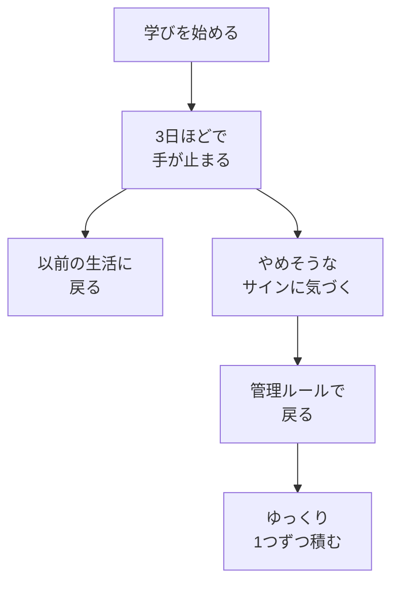

# やめないための管理——最初の壁はAIの難しさではない

## たとえ話

> 毎朝、財布の置き場所が決まっていないと、出かける前に探して手が止まります。決まった場所に置く習慣がつくと、探す手間がなくなります。
>
> 学びのメモやスプレッドシート（スプシ）も同じです。開くたびに「どこだっけ」と探すと、5分の習慣が始まる前に疲れます。不快な作業や面倒な作業は、一つずつ減らしていくのが続けるコツです。
>
> だから今日は、**やめそうなサイン**と**3日ルール**を書き、**Chrome（クローム）でメモやスプシをブックマーク**して、いつでも開けるようにします。

## 今日の課題

**やめそうなサイン・3日ルール・ゆっくり進む約束**をメモに書き、**Chromeでよく開くページをブックマーク**し、今日を Day 1 として記録する（読む時間を含めて、だいたい20〜30分を目安にしてください）。

## この教材で伸ばす力

**習慣力** — やめそうなときに気づき、自分で戻るルールを持つ力です。

## 学びの段階

今日の完了は **「できる」** です。  
3行のメモと Day 1 の記録ができればOKです。3択チェックは確認用です。

## なぜ大事か

Rebuild AI Guild では、**いちばん最初の壁は「AIが難しい」ではありません。**

多くの人が、学ぶことの大切さはわかっています。それでも、**以前の生活に戻ってしまう**ことが起きます。これは意志が弱いから、という話だけではありません。

- いつもの仕事や家事が優先される
- 「また今度」と先延ばしにする
- わからないまま進んで、疲れて手が止まる
- 他人のペースと比べて、自分を責めてやめる

**この教材も同じです。** 手をつけた人の多くは、無意識のうちに**3日ほどで止まる**と考えてください。だから、気合いだけに頼らず、**自分で管理する**必要があります。

管理とは、厳しい見張りではありません。次のような、小さな約束です。

- やめそうなときの**合図**を決める
- 止まったあと**戻る言葉**を決める
- **急いで進まない**と決める
- **わかる前に先へ進まない**と決める

習慣が身についてくると、あとからは当たり前にできるようになります。  
その前に、**立ち止まって考えること**のほうが、テクニックより大事です。

### 図解：最初の壁と管理



## 読んで学ぶ

### 最初の壁は「やめてしまうこと」

AIやPCがむずかしい、という前に、**続かない**ことが多くの人を止めます。

「学ぶことは大切」と思っていても、毎日の流れは強いです。  
新しい習慣は、いつもの生活のすき間に入れないと、すぐに押し流されます。

**自分を責めなくて大丈夫です。** 多くの人が同じ経験をします。  
大切なのは、「また今度」に任せず、**自分用の戻り方**を先に決めておくことです。

### 管理する——3日ルール

第1章で書いた3週間ルールとつながります。  
今日は、その手前の**最初の3日**に目を向けます。

**時間のイメージ**：毎日5分 → まず3日 → そのあと3週間、と段階を重ねます。

```text
【3日ルールの例】
3日続いたら、自分に「まだ3日目」と言う。
止まったら、翌日5分だけ教材を開く。
```

止まる人は多いです。だから「3日目まで戻る言葉」を、今日のうちに書いておきます。

### 早く進めばいい、とは思わない

学びは、**他人との競争ではありません。自分のペースで進むこと**です。

- 動画を倍速で見る
- わからない用語を飛ばす
- 答えだけコピーする

こうすると、一時的には進んだように見えます。  
でも、**人に説明できるレベル**まで理解していないと、すぐ同じ場所で止まります。

Rebuild AI Guild が大切にするのは、次の進み方です。

| 避ける | 代わりに |
|---|---|
| なんとなく次へ進む | わからないと感じたら止まる |
| 量をこなす | **1つ**を丁寧に理解する |
| 他人と比べる | 昨日の自分と比べる |
| テクニックだけ集める | **立ち止まって考える**時間を取る |

**ゆっくり学ぶ・深く学ぶ**とは、遅い人だけの特権ではありません。  
穴を残さず積み上げるほうが、あとから速くなるからです。

### わかる前に、先へ進まない

「とりあえずやってみる」は大切です。  
でも、**意味がわからないまま**次の章へ進むのは別です。

次のどれかに当てはまったら、そこで止まってください。

- 用語を、自分の言葉で一言説明できない
- なぜこの手順なのか、わからない
- 一緒に働く人に教えられない
- 不安だけが残っている

止まることは、負けではありません。  
**力は、小さな理解を1つずつ積み上げたときに身につきます。**

### 考えることが、いちばん大事

新しいツールやテクニックは、あとから足せます。  
その前に、**立ち止まって深く考える**習慣のほうが、長く役に立ちます。

- なぜ今これをやっているのか
- 何がわからないのか
- 今日はどこまでで十分か

考えられるようになると、AIもPCも、**増幅装置**として活きてきます（第2章の最後で深めます）。

### 面倒な作業は、一つずつ効率化する

続かないとき、学びそのものより**開くまでの面倒さ**で止まっていることがあります。

- スプシのURLを毎回探す
- メモの場所を思い出せない
- 教材のページを検索し直す

こうした作業は、小さく見えても**不快な作業**の積み重ねになります。  
一度に全部を直そうとしなくて大丈夫です。**一つずつ**、手間を減らしていきます。

今日やるのは、その第一歩として**ブックマーク**です。  
よく開くページを、Chromeの決まった場所に置いておくと、5分の習慣が始まりやすくなります。

### ブックマークは「続けるための近道」

ブックマーク（Bookmark／ブックマーク）とは、ブラウザに**ページの住所を保存しておく**機能です。

| ブックマークしておくとよいもの | 理由 |
|---|---|
| 学習用スプシ（あれば） | 記録を開く手間が減る |
| Googleドライブ（`drive.google.com`） | 第9章でスプシを置く場所。先に登録しておける |
| よく使うメモ（Googleドキュメントなど） | 書く場所が一発で開ける |
| 教材のページ（GitHubなど） | 探さずに今日の回へ戻れる |

**まだスプシがなくてもOKです。** 第9章で作ったあと、同じ手順でもう一度ブックマークすれば十分です。  
今日は、**これから毎日開くページを1つ**決めてブックマークします。

## 手順

学習メモは、Macの **メモ** アプリの **Guild 学習メモ** を使います（[第1章01](../第01章-明確な目標と習慣/01-目標を整理する.md) で作ったノート）。Dockの **メモ** アイコンから開きます。


### メモを開く

1. 画面下の Dock で、上の画像と同じ **メモ** アイコンを **1回クリック**する。
2. 左の一覧から **Guild 学習メモ** を選ぶ。まだない場合は第1章01のステップ0を先に済ませる。

**まずステップ1だけやってから、読み返してもOKです。**

### ステップ1：やめそうなサインを1つ決める（5分）

**Guild 学習メモ** に、次を書きます。

```text
【私のやめそうなサイン】
（例：2日連続で教材を開かなかった）
（例：「難しいから向いていない」と思い始めた）
（例：他人の投稿を見て焦った）
```

1つで十分です。気づいたら、このサインを合図に戻ります。

### ステップ2：3日ルールを1行書く（5分）

```text
【この教材の3日ルール（今日から　月　日）】
3日続けるために、（いつ・何分・戻る言葉）を守る。
```

上の（　）は消して、下の例のように1文で書いてください。

例：「毎朝コーヒーの前に5分だけ開く。止まったら翌朝『まだ3日目』と言って5分戻る。」

第1章をまだやっていない場合は、「毎朝コーヒーの前に5分」のように、**いつ・何分**だけ書けば十分です。  
第1章の「毎日やる1アクション」と**同じ時間帯**にすると、覚えやすいです。

### ステップ3：ゆっくり進む約束を1行書く（5分）

```text
【ゆっくり進む約束】
（例：わからない用語は1つメモしてから次へ進む）
（例：人に説明できないところでは止まる）
（例：他人のペースと比べない）
```

### ステップ4：今日の5分を実行する（5分）

ここから、今日の5分を実際にやります。  
この教材を開いたら、メモに「Day 1」と書いてください。  
5分で終わっても、開いた事実が大事です。第1章の振り返り欄に1行追記してもOKです。

### ステップ5：Chromeでブックマークする（5分）

**Google Chrome（グーグル・クローム）** で、毎日開くページを1つブックマークします。

1. **Chrome** を開く（Dock（ドック）の丸いアイコン、または Launchpad（ランチパッド）から）。
2. アドレスバー（画面上部の白い欄）に、次のどれかを入力して Enter を押す。
   - すでに学習用スプシがある → そのURL
   - まだない → `https://drive.google.com`（Googleドライブ。第9章でスプシを置く場所）
3. ページが開いたら、アドレスバー**右端の星マーク（☆）** をクリックする。  
   またはキーボードで **Command（コマンド） + D** を押す。
4. 名前を付ける（例：「Guild 学習メモ」「Guild スプシ」）。**完了** または **保存** を押す。
5. 画面上部のメニュー **表示** → **ブックマークバー** → **常に表示** を選ぶ（まだバーが出ていない場合）。
6. 星の下にブックマークが並んだら、**1回クリック**して同じページが開くか確認する。

> **スクショ案内**：ブックマークバーに「Guild 学習メモ」などの名前が表示され、クリックでページが開く画面。

メモに次を1行書きます。

```text
【ブックマークしたページ】
（例：Googleドライブ / 学習用スプシ）
```

## 3択チェック

> 答えは別ページです。わからなくても、先に自分の理由を一行書いてから、答え合わせに進んでください。

1. Rebuild AI Guild が言う「最初の壁」に近いのはどれですか？
   - A. AIの設定がむずかしすぎること
   - B. 学びを始めても、やめて以前の生活に戻ること
   - C. Mac（マック）を買っていないこと

2. この教材の進み方として、Guild が勧めるのはどれですか？
   - A. わからないまま先の章へ進み、あとでまとめて理解する
   - B. 人に説明できるレベルまで1つずつ積み上げ、急いで進まない
   - C. 他人と同じペースで進み、遅れたらやめる

3. 学びを続けるうえで、Guild がいちばん大切にするのはどれですか？
   - A. 新しいテクニックを早く覚えること
   - B. 立ち止まって考えることと、自分で戻る管理ルール
   - C. 毎日3時間以上勉強すること

4. 面倒な作業を減らして続けるために、今日勧めているのはどれですか？
   - A. 毎回URLを検索し直す
   - B. Chromeのブックマークで、よく開くページを一発で開けるようにする
   - C. すべての手順を頭で覚える

答え合わせはこちら：  
[答えを見る](../../答え/第02章-学びの土台/00-やめないための管理-答え.md)

## できたらOK

- やめそうなサインが1つ書けている
- 3日ルールが1行書けている
- ゆっくり進む約束が1行書けている
- Chromeでページを1つブックマークし、1クリックで開ける
- 3択チェックに自分で答えた
- 今日を Day 1 として記録した（または明日5分で戻ると決めた）

## つまずいたら

**躓いたら戻る先**

- [第1章 05 毎日1アクションとトリガー](../第01章-明確な目標と習慣/05-毎日1アクションとトリガー.md) — 5分の行動が大きすぎるとき
- [第1章 07 スタート3週間ルール](../第01章-明確な目標と習慣/07-スタート3週間ルール.md) — 3週間の区切りをまだ書いていないとき
- [第1章 09 うまくいかないとき](../第01章-明確な目標と習慣/09-うまくいかないとき考える.md) — 自分を責めて止まってしまったとき
- [第9章 01 スプレッドシートテンプレをコピーする](../第01章-明確な目標と習慣/02-学習管理スプシをコピーする.md) — スプシをまだ作っていないとき（作ったあとブックマークし直す）

```text
【今やっている教材】
第2章 00 やめないための管理

【詰まったところ】
（例：3日ルールの書き方がわからない）

【試したこと】
（例：やめそうなサインを1つ書いた）

【どうなればOKか】
（例：戻る言葉の例がほしい）
```

## 今日の成果物

- **やめそうなサイン・3日ルール・ゆっくり進む約束**のメモ
- **ブックマークしたページ**の記録
- **Day 1** の記録

## 問い

あなたがこれまで学びや仕事の改善をやめてしまったとき、**いつもの生活に戻る前**に、どんなサインがありましたか。  
明日、忙しくても5分だけなら、何をしますか。（例：教材を開いて Day 2 と書く）

## 進む

- [答えを見る（任意）](../../答え/第02章-学びの土台/00-やめないための管理-答え.md)
- [次のテーマ：早く結果が欲しい——その欲に気づく](./01-早く結果が欲しい-その欲に気づく.md)
