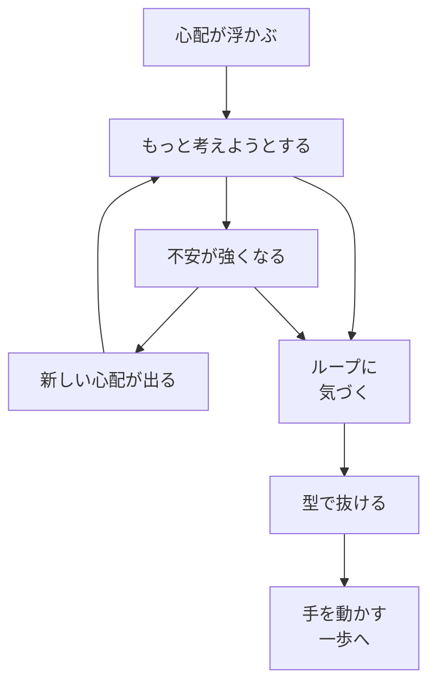

# 考えすぎは不安のループ——堂々巡りに気づく

## たとえ話

> 洗濯物を干す場所がわからなくて、部屋の中をぐるぐる歩き回る。動いているのに、目的の場所には着かない。学びでも、似たことが起きる。頭の中で同じ心配を何度もなぞり、まだ手を動かしていないのに疲れてしまう。多くの場合、それは問題を解くための考えではなく、不安が増えていくループだ。だから今日は、その堂々巡りに気づき、抜け道の型を一つ試す。

## 今日のゴール

頭の中で堂々巡りしている場面を1つ書き、対処の型を1つ試す。

## この教材で伸ばす力

**判断する力** — 不安のループに気づき、考え方の向け先を変えられるようになる

## 学びの段階

今日の完了は **「できる」** です。  
ループに入った場面を1つ書き、下の型のどれかを1つ試せばOKです。

## なぜ大事か

Rebuild AI Guild では、**自分の状態をマネジメントする**ことを、道具の前に置きます。

考えること自体は悪くありません。問題を整理するとき、考えは力になります。  
ただ、次のようなときは、考えが問題解決ではなく **不安のループ** になっていることがあります。

- 心配が次から次へと浮かぶ
- 問題を考えても、すぐ別の心配に入れ替わる
- 「この問題さえ片づけば楽になる」と思うが、片づいても安心が続かない
- 手を動かす前に、頭だけが疲れる

大切なのは、**目の前の問題そのもの**より、**その問題をどう受け止めているか**です。  
ループに気づけば、「もっと考えれば解決する」と追い込まなくてよくなります。

第4章以降では、週報や時間の見える化でも同じ型を使えます（任意）。  
[第4章 日報・週報で振り返る](../第01章-明確な目標と習慣/08-日報・週報のはじめ.md)

### 図解：不安のループ



## 読んで学ぶ

### ループに入ったサイン

次のどれかに当てはまったら、ループの可能性があります。

- 同じことを何度も頭の中で繰り返している
- 今夜考えても決まらないテーマを、今すぐ考えようとしている
- 体が疲れているのに、頭だけが休まない

### 抜け道の型（今日は1つだけ）

#### 型1：心配の先延ばし

心配は無視しなくてよい。**心配する時間を決める**だけです。

> 今は考えない。〇〇（日時）に考える。

やるべき作業の先延ばしではありません。  
**心配だけ**を、決めた時間まで預けます。

#### 型2：身体に意識を戻す

不安が強いとき、頭の中で考えを増やすと、ループが強くなりやすいです。  
そこで、**呼吸・手のひらの感覚・足の裏・周りの音**など、身体や五感に意識を向けます。

決まった言葉を唱える必要はありません。  
「今、息が出入りしている」「椅子に座っている感覚」など、一つでよいです。

#### 型3：集中する対象を変える

不安でいっぱいのときは、見る場所を変えるだけで楽になることがあります。

| 意識を向ける | 手放す |
|---|---|
| コントロールできること | コントロールできないこと |
| できること | できないこと |
| すでに持っているもの | 持っていないもの |
| 現在 | 過去や未来 |
| 必要なもの | 欲しいもの |

今日は、表の左のどれか **1つ** を選び、メモに一行書いてみてください。  
難しければ、まず型2（身体）からでよいです。

## 手を動かす

Dockの **メモ** アイコンから **Guild 学習メモ** を開きます。

### ステップ1：ループの場面を書く

最近「考えているのに進まなかった」場面を一行書きます。  
書けない場合は「わからない」でOKです。

### ステップ2：型を1つ試す

上の型1〜3から **1つ** 選び、試します。

- 型1なら、心配を預ける日時を一行書く
- 型2なら、身体の感覚に30秒ほど向ける
- 型3なら、左の列から1つ選んで一行書く

### ステップ3：変化を一行メモする

試したあと、「少し変わったこと」「まだ変わらないこと」のどちらかを一行書きます。  
変わらなくても、試した事実が成果です。

## わからないまま進まないチェック

- どの型を選べばいいかわからない → まず型2（身体）からでよい
- ループの場面が書けない → [01 早く結果が欲しい](./01-早く結果が欲しい-その欲に気づく.md) の「急いでいること」を使ってよい
- 型を試しても不安が残る → 今日はここまででOK。次は [03 5分を大切にする](./03-5分を大切にする-塵も積もれば山となる.md) へ

## できたらOK

- ループに入った場面を1つ書いた
- 型1〜3のどれかを1つ試した
- 4択チェック3問に答えた（答えは任意）

## 4択チェック

1. 考えすぎのループについて、Rebuild AI Guild が伝えたいことはどれですか？
   - A. 考える力が低いから起きる
   - B. 問題そのものより、受け止め方と不安の扱いが鍵になる
   - C. もっと長く考えれば必ず解決する
   - D. 心配は全部、今すぐ考えるべきだ

2. 心配の先延ばしについて、正しいのはどれですか？
   - A. 心配を無視して、二度と考えない
   - B. 心配する時間を決め、今は預ける
   - C. やるべき作業も、すべて先延ばしにする
   - D. 心配は悪いことなので、消すべきだ

3. ループから抜けるために、今日勧めているのはどれですか？
   - A. 同じ心配を、頭の中でもっと深く考える
   - B. 型を1つ選び、試してみる
   - C. 全部の型を一度にやる
   - D. 気づかなくてよい。気づきは不要だ

答え合わせはこちら：  
[答えを見る](../../答え/第02章-学びの土台/02-考えすぎは不安のループ-堂々巡りに気づく-答え.md)

## つまずいたら

```text
【今やっている教材】第2章 02 考えすぎは不安のループ

【詰まったところ】

【試したこと】

【どうなればOKか】ループ1行＋型を1つ試せればOK
```

**躓いたら戻る先**

- [01 早く結果が欲しい](./01-早く結果が欲しい-その欲に気づく.md) — 急ぎの正体をもう一度確かめる
- [00 やめないための管理](./00-やめないための管理.md) — 一人で抱え込まない

## 今日の成果物

- ループの場面メモ1行
- 試した型と、そのあとの一行メモ

## 問い

ループから抜けたあと、**手を動かす**としたら、いちばん小さな一歩は何でしょうか。

## 進む

← [01 早く結果が欲しい](./01-早く結果が欲しい-その欲に気づく.md) ｜ [第2章目次](./README.md) ｜ [03 5分を大切にする](./03-5分を大切にする-塵も積もれば山となる.md) →

※ 旧版の教材番号でブックマークしている場合：旧「02 思考の癖」は [06 本質的に変えるのは思考の癖](./06-本質的に変えるのは思考の癖.md) へ移動しました。
