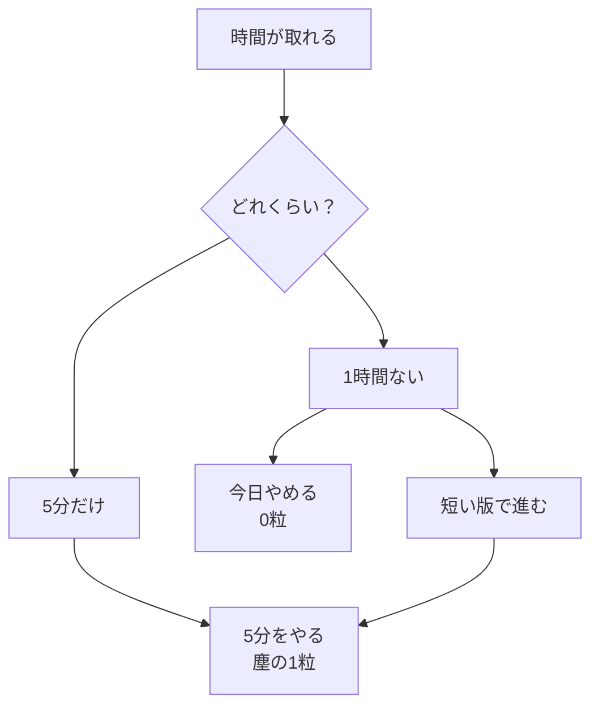

# 5分を大切にする——塵も積もれば山となる

## たとえ話

> 砂浜に一粒ずつ砂を足していく。1粒では何も変わらないように見える。でも「1粒は意味がない」と決めてしまうと、山は永遠にできない。学びも同じです。5分は「足りない時間」ではなく、山の1粒。今日は、その1粒を軽視しない練習をします。

## 今日のゴール

「5分しかない日にやる1つ」を決め、実際に5分だけ手を動かす（2分で終わってもよい）。

## この教材で伸ばす力

**続ける力** — 取れた時間のサイズで進める。全部か無かをやめる。

## 学びの段階

今日の完了は **「できる」** です。  
5分（または2分）の行動を1つ実行したことが確認できればOKです。

## なぜ大事か

[01 早く結果が欲しい](./01-早く結果が欲しい-その欲に気づく.md) で、急ぎの欲を見ました。  
[02 考えすぎは不安のループ](./02-考えすぎは不安のループ-堂々巡りに気づく.md) で、頭の中の堂々巡りを見ました。

ここでは、脱落のもう一つの癖——**小さな時間を無価値とみなす**——に向き合います。

| よくある思考 | 実際に起きること |
|---|---|
| 5分しかないから今日はやめる | 今日を丸ごと失う |
| 1時間取れないなら意味がない | 取れる日が来るまで何もしない |
| すぐ結果が出ないからやめる | 積み上げの途中で離脱する |

**塵も積もれば山となる。** スキルは、小さな基礎の積み重ねと組み合わせです。  
第1章のスタート3週間とセットで、**休むのではなく短くする**練習場でもあります。

### 図解



## 手を動かす

Dockの **メモ** アイコンから **Guild 学習メモ** を開きます。

### ステップ1：全部か無かの思考を書く

最近「5分しかないからやめた」「1時間取れないからやめた」場面を、一行書きます。

### ステップ2：言い換えを一行書く

同じ場面を、「取れた時間のサイズで進む」言い方に一行だけ書き換えます。

### ステップ3：5分（または2分）でやることを1つ決める

取れた時間のサイズで進めるなら、**今日いちばん小さくできること**を1つ書きます。  
決められないときは、この教材の4択を1問だけ読む、でもOKです。

### ステップ4：決めたことを実行する

ステップ3で書いたことを、5分（または2分）だけ手を動かします。  
開いた・動いた事実が成果です。

## わからないまま進まないチェック

- 全部か無かが抜けない → [01 早く結果が欲しい](./01-早く結果が欲しい-その欲に気づく.md)

## できたらOK

- 言い換えを一行書いた
- 5分（または2分）の行動を1つ実行した
- 4択チェックに答えた（答えは任意）

## 4択チェック

1. 5分の学びについて、Rebuild AI Guild が伝えたいことはどれですか？
   - A. 5分は意味がない
   - B. 5分は塵の1粒。積もれば山になる
   - C. 1時間取れない日は、学びをゼロにすべき
   - D. すぐ結果が出ないなら、積み上げをやめるべき

2. 「1時間ないから意味がない」と感じたとき、いちばん近い次の一歩はどれですか？
   - A. 今日は丸ごとやめる
   - B. 2分だけ教材を開く
   - C. 完璧な1時間が取れる日まで待つ
   - D. 全部の教材を一気に読む

3. スタート3週間（第1章07）と合わせて覚えたいのはどれですか？
   - A. 気分が乗らない日はスキップしてよい
   - B. 短くても、その日は手を動かす
   - C. 3週間は休んでから始める
   - D. 5分未満はカウントしない

答え合わせはこちら：  
[答えを見る](../../答え/第02章-学びの土台/03-5分を大切にする-塵も積もれば山となる-答え.md)

## つまずいたら

```text
【今やっている教材】第2章 03 5分を大切にする

【詰まったところ】

【試したこと】

【どうなればOKか】言い換え1行＋5分（または2分）の行動があればOK
```

## 今日の成果物

- 言い換えメモ1行
- 5分（または2分）の行動の記録

## 問い

忙しい日に「5分だけなら」と思える場面は、あなたの生活のどこにありそうですか。

## 15分版 / 2分版

| 版 | 内容 |
|---|---|
| 2分版 | ステップ3でやる1つを決めるだけ |
| 15分版 | ステップ2〜4を短く。実行は2分でも可 |

**Guild 学習メモ** に書いた内容は、あとで [第1章05 日報・週報](../第01章-明確な目標と習慣/08-日報・週報のはじめ.md) に移す材料になります（今はスプレッドシートを開かなくてよい）。

## 進む

← [02 考えすぎは不安のループ](./02-考えすぎは不安のループ-堂々巡りに気づく.md) ｜ [第2章目次](./README.md) ｜ [04 考える時間を大切にする](./04-考える時間を大切にする-急がず丁寧に積み重ねる.md) →
