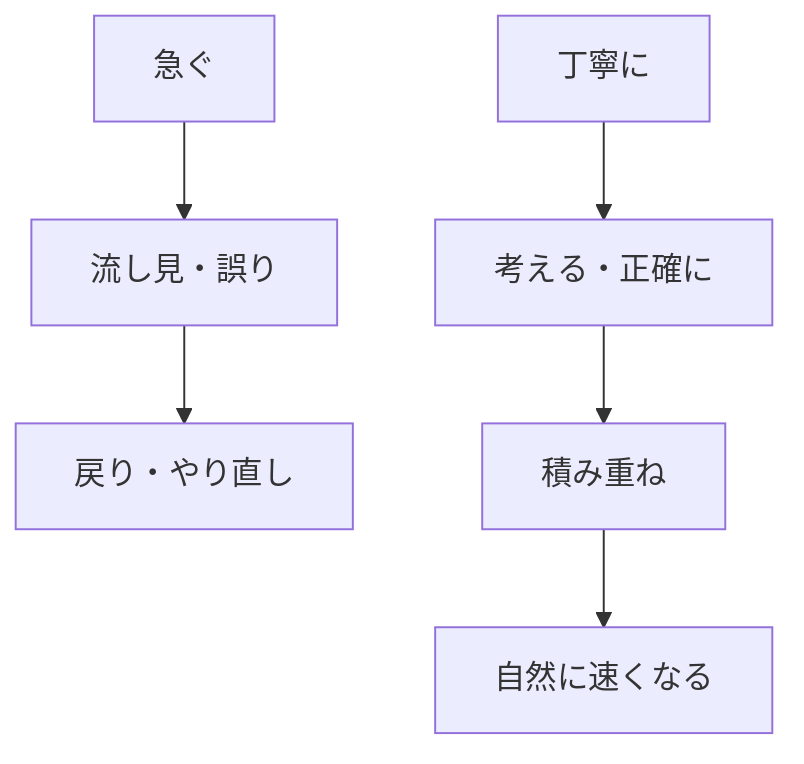

# 考える時間を大切にする——急がず丁寧に積み重ねる

## たとえ話

> 新しい道を歩くとき、地図を一目で流し見して走り出すと、すぐ迷子になる。一歩ずつ、目印を確かめながら進むほうが、のちのほうが速く着けることがある。タイピングも同じです。キーボードを見て急いで打つより、見ないで正確に打つ練習を繰り返すほうが、あとから自然に速くなる。今日は、急がず丁寧に、タイピングでそれを体験します。

## 今日のゴール

タイピングをキーボードを見ずに、正確性を優先して1セット行う（15分版では省略可）。急いで進もうとした場面を一行書き、丁寧に進む言い換えを一行書く。

## この教材で伸ばす力

**続ける力** — 急がず、丁寧に、繰り返す

## 15分版 / 2分版

| 版 | 内容 |
|---|---|
| 2分版 | F/Jの凸印を触る＋「急がない」1行 |
| 15分版 | タイピングは省略可。ステップ1と4（急ぎの場面＋言い換え）だけでもOK |

## 学びの段階

今日の完了は **「できる」** です。  
言い換え1行があればOKです。タイピング1セット（見ない・正確優先）は15分版では省略できます。

## なぜ大事か

Rebuild AI Guild は**章を急いで進める場所ではない**。  
AIやCursorの前に、**学び方の土台**を置きます。

| 急ぐ学び | 丁寧な学び |
|---|---|
| 次の教材へ飛ぶ | わからないところで考える時間を取る |
| スコアを追う | 正確に、キーボードを見ずに打つ |
| 量で安心する | 1つの理解が身につくまで繰り返す |

**考える時間は、サボりではない。** 止まって考える・打ち直す・戻る——これが土台になります。

タイピングは、ここでの目的が速さではないことを示す**実践場**です。

### 図解



## 手を動かす

Dockの **メモ** アイコンから **Guild 学習メモ** を開きます。

### ステップ1：急ぎの場面を一行書く

教材や仕事で「早く進もう」と思った場面を一行書きます。

### ステップ2：タイピングのルールを確認する

1. **正確性** — 間違えたら打ち直す。スピードは見ない
2. **キーボードを見ない** — ゆっくりでよい。FとJの凸印に人差し指
3. **ホームポジション** — 打鍵後、指を戻す

ツールを1つ選ぶ：[マイタイピング](https://www.e-typing.ne.jp/) か [寿司打](https://typing.karou.jp/)

### ステップ3：タイピング1セット（任意）

見ないモード、またはキーボードを見ない前提で、短い課題を1セット行います。  
**打鍵速度やクリアタイムは見ない・記録しない。**  
15分版でタイピングを省略する場合は、このステップを飛ばしてステップ4へ進んでください。

### ステップ4：言い換えを一行書く

ステップ1の「急いで進もう」を、「丁寧に1つずつ」に言い換えます。

## わからないまま進まないチェック

- キーボードが見えてしまう → ゆっくりでよい。見えたら1文字だけやり直す
- 遅くて焦る → [01 早く結果が欲しい](./01-早く結果が欲しい-その欲に気づく.md)
- 5分しかない → [03 5分を大切にする](./03-5分を大切にする-塵も積もれば山となる.md)

## できたらOK

- 言い換えを一行書いた
- タイピング1セットを終えた（正確性優先）— 省略した場合は不要
- 4択チェックに答えた（答えは任意）

## 4択チェック

問：タイピング練習でいちばん大事なのはどれですか？

- A. 1分間にたくさん打つ
- B. 正確に、キーボードを見ずに、繰り返す
- C. 隣の人より速くなる
- D. 今日中に上級コースへ進む

答え合わせはこちら：  
[答えを見る](../../答え/第02章-学びの土台/04-考える時間を大切にする-急がず丁寧に積み重ねる-答え.md)

## つまずいたら

```text
【今やっている教材】第2章 04 考える時間を大切にする

【詰まったところ】

【試したこと】

【どうなればOKか】
```

## 今日の成果物

- 急ぎの場面メモ1行
- 言い換え1行
- タイピング1セットの記録（速度は見ない）

## 問い

タイピングで「キーボードを見ない」と決めたとき、学びのほかの場面でも見ないようにしたい癖はありますか。

## 進む

← [03 5分を大切にする](./03-5分を大切にする-塵も積もれば山となる.md) ｜ [第2章目次](./README.md) ｜ [05 人と比べない](./05-人と比べない-一ヶ月前の自分と比べる.md) →

**第2章08との違い**：本テーマは「急がない・丁寧に積む」。08は「わからないまま進まない」。
