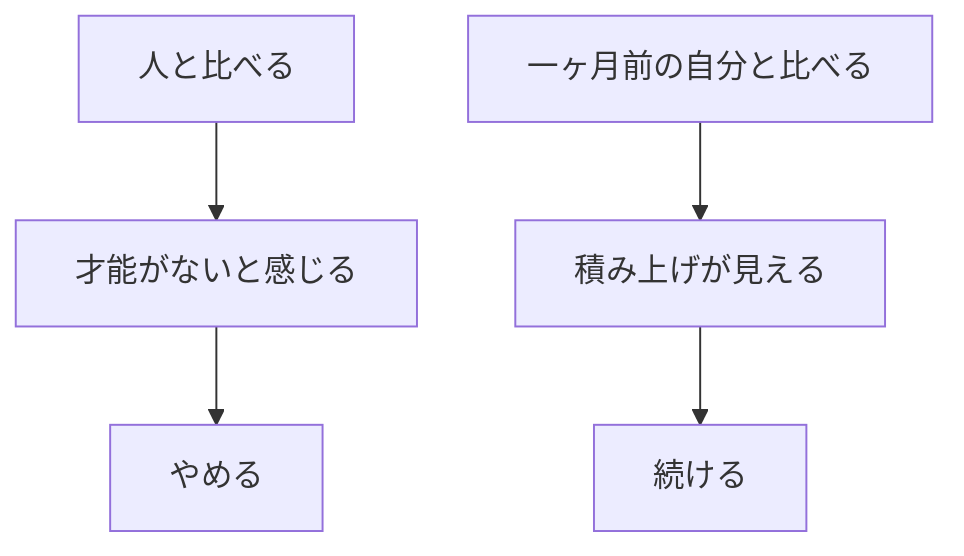

# 人と比べない——一ヶ月前の自分と比べる

## たとえ話

> 山を登っているとき、隣の登山者の足元ばかり見ていると、「自分は遅い」としか感じない。でも一ヶ月前の自分が立っていた場所を振り返ると、確かに高いところにいる。昨日の自分と比べても、一歩の差は小さすぎてわからない。今日は、隣ではなく、一ヶ月前の自分を見る練習をします。

## 今日のゴール

「人と比べてやめそうになった場面」を1つ書き、一ヶ月前の自分と比べて変わったことをメモに残す。

## この教材で伸ばす力

**続ける力** — 比較をやめ、自分の積み上げだけを見る

## 学びの段階

今日の完了は **「気づいた」以上** です。  
比較の場面を1つ言葉にし、一ヶ月前との対比メモを残せばOKです。

## なぜ大事か

Rebuild AI Guild では、**隣の人・SNS・有名な人と比べない。**

| 比べ方 | 結果 |
|---|---|
| 人と比べる | 「自分には才能がない」と感じてやめる |
| 昨日の自分と比べる | 差が小さすぎて見えない |
| **一ヶ月前の自分と比べる** | 積み上げが見える |

**人と比べるのは時間の無駄。** 比べるなら、一ヶ月前の自分です。

### 図解



## 手を動かす

Dockの **メモ** アイコンから **Guild 学習メモ** を開きます。

### ステップ1：比較の場面を書く

Discord・職場・SNS・ギルド内で「あの人はすごい／自分は無理」と感じた場面を一行書きます。

### ステップ2：言い換えを一行書く

「人と比べるのは時間の無駄」と、自分の言葉で一行書きます。

### ステップ3：一ヶ月前の自分と比べる

一ヶ月前と比べて変わったことをメモします。書けたところからでよいです。  
一ヶ月未満の人は「ギルドに入る前の自分」と比べてよいです。

## コラム：積み上げの話

> スタート地点が違う人がいても、**人と比べず**、5分・10分を積み重ね続けた人がいる。一ヶ月前の自分と比べると、確かに変わっていた。**比べなかったから、やめなかった。**
>
> 学歴やスタートは違っていい。比べるのは、一ヶ月前の自分だけでよい。

## わからないまま進まないチェック

- 一ヶ月前と変わっていない気がする → 昨日ではなく一ヶ月。続けた日数だけでもよい
- やはりあの人がすごい → [01 早く結果が欲しい](./01-早く結果が欲しい-その欲に気づく.md)
- 5分しかない → [03 5分を大切にする](./03-5分を大切にする-塵も積もれば山となる.md)

## できたらOK

- 比較の場面を1つ書いた
- 言い換えを一行書いた
- 一ヶ月前との対比メモを残した
- 4択チェックに答えた（答えは任意）

## 4択チェック

問：成長を確かめるのにいちばんよい比べ方はどれですか？

- A. 隣の人の進み方
- B. 昨日の自分
- C. **一ヶ月前の自分**
- D. SNSで活躍している人

答え合わせはこちら：  
[答えを見る](../../答え/第02章-学びの土台/05-人と比べない-一ヶ月前の自分と比べる-答え.md)

## つまずいたら

```text
【今やっている教材】第2章 05 人と比べない

【詰まったところ】

【試したこと】

【どうなればOKか】
```

## 今日の成果物

- 比較の場面メモ
- 言い換え1行
- 一ヶ月前との対比メモ

## 問い

人と比べてしまいそうな場面は、あなたの周りのどこにありそうですか。比べる代わりに、一ヶ月前の自分に聞いてみたいことは何ですか。

## 進む

← [04 考える時間を大切にする](./04-考える時間を大切にする-急がず丁寧に積み重ねる.md) ｜ [第2章目次](./README.md) ｜ [06 本質的に変えるのは思考の癖](./06-本質的に変えるのは思考の癖.md) →
