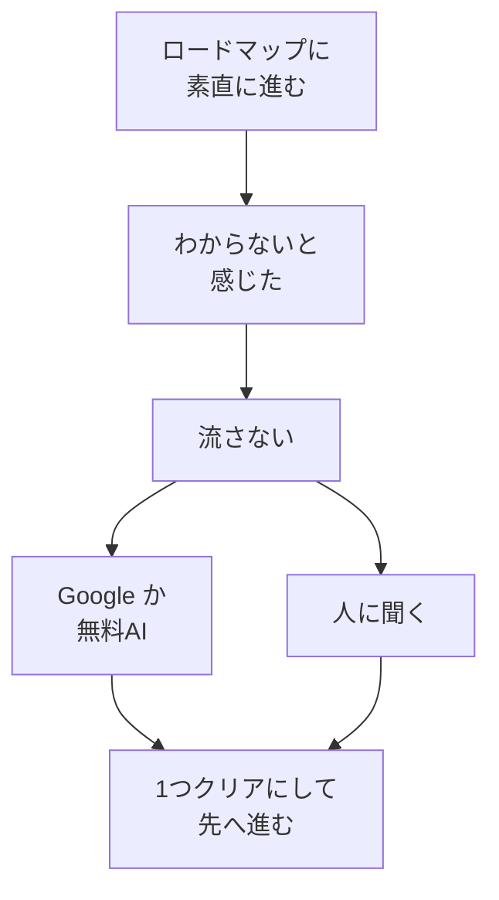

# 遠回りしてでも調べる——流さないことが土台になる

## たとえ話

> 体の一部だけを強く鍛えると、弱いところが先に痛めやすい。学びでも同じです。わからない用語を「後でいいや」と流すと、弱いところが残ります。先に進みたい気持ちが、その弱いところを無理に引っ張ると、同じ場所でまた止まります。だから今日は、**流さない**ことを練習します。少し遠回りに感じても、一つずつクリアにしていきましょう。

## 今日の課題

ロードマップに素直に進む約束と、「わからないことを流さず遠回りする」型を理解し、**1つだけ**試す。

## この教材で伸ばす力

**進める力・相談する力・思考力** — 何を流さないか選び、調べる・聞く・AIに聞くを組み合わせて前に進む力です。

## 学びの段階

今日の完了は **「できる」** です。  
流しそうなことを1つ書き、Google（グーグル）検索か無料のChatGPT（チャットジーピーティー）／Claude（クロード）の**どちらか1回**を試せればOKです。

### 15分ルートと30分ルート

| ルート | やること |
|---|---|
| **15分** | ステップ1 → ステップ2（Google検索のみ）→ ステップ4。ステップ3・4択は任意 |
| **30分** | 本文を読む → ステップ1〜4 → 人に聞く下書き（任意）→ 4択チェック |

**今日5分だけ**なら、ステップ1（流しそうなことを書く）だけでも十分です。

## なぜ大事か

**ロードマップ**とは、このGuildの教材を**番号どおりに進める道のり**のことです（[第2章目次](./README.md) が地図になります）。

Rebuild AI Guild では、**ロードマップに素直に従う**ことを大切にします。  
今のあなたは、何を調べればいいかわからないかもしれません。それで問題ありません。**順番どおり進むことが、いまの守**です。

同時に、わからないことを**そのまま流さない**ことも大切です。

| 流して進む | 遠回りして1つクリアにする |
|---|---|
| 同じところで何度も止まる | 次に進むときの負担が減る |
| 「なんとなく」が増える | 自分の言葉で説明できる部分が増える |
| 焦りだけが残る | 長期では、より高いところへ進みやすい |

遠回りに感じる時間も、**弱いところを鍛える時間**です。

### 守破離（しゅはり）——今日は「守」の話

**今日は「守」の行だけ読めばOKです。** 破・離は表の参考です。あとで読んでも大丈夫です。

日本の武道などで使われる言葉で、学びの長い流れを表します。

| 段階 | 読み | いまのあなたへの意味 |
|---|---|---|
| **守** | しゅ | 型どおり。ロードマップに素直に進む。わからないことは遠回りして調べる・聞く |
| **破** | は | 型を自分の仕事用に崩す（第9章・第11章あたりで本格化） |
| **離** | り | 自分で学ぶ順番と優先順位を決める（1〜2年後・発展コース） |

1年後、2年後に自分で必要なものを選べる状態は、いまの遠回りの積み重ねから生まれます。

**自分で調べる＝全部1人でやることではありません。** 調べる・AIに聞く・人に聞くは、協力しながら進む守のうちです。

### 図解：ロードマップと遠回り



悪い道（流して進む）は、上の表で対比しています。

## 読んで学ぶ

### いまの約束（守）

1. **教材の順番どおり**に進む（飛ばしすぎない）
2. **わからないと感じたら**、[08 ゆっくり学ぶ](./08-ゆっくり学ぶ-わからないまま進まない.md) のとおり止まってよい
3. **止まったあと**、今日の1つだけ遠回りする（調べる・AI・人に聞く）

第9章では無料AIを本格的に練習します。第10章ではCursor（カーソル）の月額課金と公式情報の見方を学びます。**今日は、その入り口の考え方だけでOK**です。

### 人に聞くときの型

相手は、多い情報の中から質問に答える部分を**必要な部分だけ選びます**。だから、**情報は多めに渡す**ほうがありがたいです。

```text
【今どういう状況か】
（例：第2章10を読んでいて、〇〇がわからない）

【何がわかっていて、何がわかっていないか】
わかっている：
わかっていない：

【スクショがあるか】
ある／ない（ある場合は画面の該当部分）
```

**Discord（ディスコード）**は、Guildの質問・相談用のコミュニティです。使っていなくても、今日の完了には不要です。投稿するかは任意で、**下書きが1セットあればOK**です。

## 手を動かす

Dockの **メモ** アイコンから **Guild 学習メモ** を開きます。

### ステップ1：流しそうになったことを書く（5分）

**Guild 学習メモ** に、次を書きます。

```text
【流しそうになったこと】
（教材の用語、操作、手順の「なぜ」など）
```

**例**（そのまま写しても、自分の言葉に変えてもよいです）：

- 「ロードマップって何？」
- 「守破離の意味がぼんやり」
- 「スプレッドシートのセルって何？」

[08](./08-ゆっくり学ぶ-わからないまま進まない.md) で決めた「止まる合図」に当てはまるものがあれば、それを1つ選んでもよいです。

### ステップ2：Google か 無料AI のどちらか1回（10〜15分）

**どちらか片方だけ**で大丈夫です。

**A. Googleで検索する**

1. ブラウザで [Google](https://www.google.com) を開く。
2. わからないことを、**短い言葉**で検索する（例：「スプレッドシート セル 入力」）。
3. そのサービス本人のサイト（公式に近いページ）や、Guildの教材リンクを1つ開き、**1行メモ**する。

**B. 無料の ChatGPT か Claude に聞く**

> **注意**：お客さまの名前・電話・住所・売上など、**実データは書かない**でください。

1. すでにアカウントがある方だけ、 [ChatGPT](https://chatgpt.com/) か [Claude](https://claude.ai/) を開く。
2. 次のように聞く（コピーして使ってよいです）。

```text
Rebuild AI Guild の学習中です。次のことがわかりません。
【わかっていないこと】
（ここに書く）
【いま試したこと】
（ここに書く）
初心者向けに、短く教えてください。
```

3. 返答を読み、**自分の言葉で1行**メモする。

アカウントがない場合は、**AのGoogle検索だけ**で完了です。

### ステップ3：人に聞く下書き（任意・5分）

上の「人に聞くときの型」を、1セット下書きします。投稿はしなくてよいです。

### ステップ4：クリアにしたことを1行（2分）

```text
【今日クリアにしたこと】
（例：〇〇という用語の意味が、自分の言葉で言えるようになった）
```

## わからないまま進まないチェック

- 検索結果が多すぎて迷う → 公式に近いページを1つだけ開く。全部読まなくてよい
- AIの答えが難しい → 「もっと短く、初心者向けに」と1行足す
- アカウントがない → Google検索だけでOK

## できたらOK

- 流しそうになったことを1つ書いた
- Google検索か無料AIの**どちらか1回**を試した
- 「今日クリアにしたこと」を1行書いた
- 4択チェック3問に答え、答えページで確認した（任意）

## 4択チェック

わからなくても、**先に自分の理由を一行書いてから**答え合わせへ進んでください。

1. 「遠回りして調べる」とRebuild AI Guild の考え方として近いのはどれですか？
   - A. 時間の無駄なので、わからないことは全部飛ばす
   - B. 流さず1つクリアにするほうが、長期では近道になりやすい
   - C. ロードマップは見なくてよい
   - D. 人に聞くのは負けなので禁止

2. 「自分で調べる」の意味として近いのはどれですか？
   - A. 全部1人で黙って進むこと
   - B. 調べる・AIに聞く・人に聞くを組み合わせながら、自分で前に進むこと
   - C. 教材よりネットの情報だけを信じること
   - D. わからないまま進むこと

3. 守破離の「守」と、いまのあなたの進め方として近いのはどれですか？
   - A. すぐに全部自分で学ぶ順番を決める（離）
   - B. ロードマップに素直に進み、わからないことは遠回りして調べる・聞く
   - C. 型はもう不要なので教材を飛ばす（破）
   - D. AIにすべて任せて考えない

答え合わせはこちら：  
[答えを見る](../../答え/第02章-学びの土台/10-遠回りしてでも調べる-流さないことが土台になる-答え.md)

## つまずいたら

```text
【今やっている教材】第2章 10 遠回りしてでも調べる

【今どういう状況か】

【何がわかっていて、何がわかっていないか】
わかっている：
わかっていない：

【スクショがあるか】

【試したこと】

【どうなればOKか】
```

**躓いたら戻る先**

- [08 ゆっくり学ぶ](./08-ゆっくり学ぶ-わからないまま進まない.md) — 止まる合図を思い出すとき
- [09 AIは増幅装置](./09-AIは増幅装置-1年後の視点と進め方.md) — なぜ今土台かを確認するとき
- [01 早く結果が欲しい](./01-早く結果が欲しい-その欲に気づく.md) — 遠回りを「損」と感じるとき

## 今日の成果物

- 流しそうになったことのメモ
- 検索またはAIの結果を1行にしたメモ
- （任意）人に聞く下書き

## 問い

あなたにとって「遠回り」に感じやすいのは、調べること・AIに聞くこと・人に聞くことのどれでしょうか。  
それでも流さず1つクリアにしたとき、どんな変化がありそうでしょうか。

次は [11 習慣ルールを見直す](./11-習慣ルールを見直す.md) です。第1章の21日がまだ満たない場合は、11は**読むだけ**で第3章へ進んでも大丈夫です。11〜13は第2章の締めくくりとして、あとから戻ってもよいです。

## 進む

← [09 AIは増幅装置](./09-AIは増幅装置-1年後の視点と進め方.md) ｜ [第2章目次](./README.md) ｜ [11 習慣ルールを見直す](./11-習慣ルールを見直す.md) →
