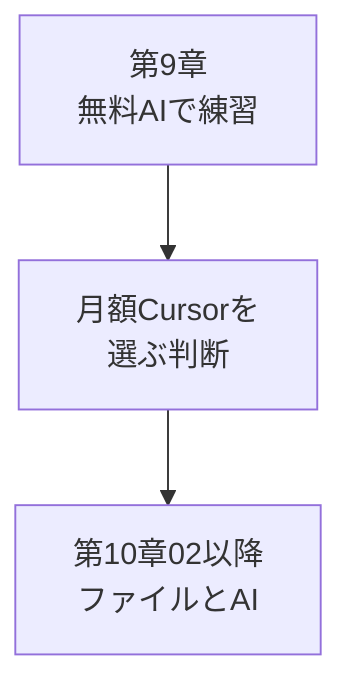
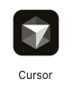

# Cursorを月額で始める——最初の課金は月額で

## たとえ話

> 新しい道具を買うとき、いきなり年間契約だけを選ぶと、合わなくても切り替えにくくなります。月ごとに続けるか選べるなら、実際に使ってから決め直せます。高い買い物ほど、最初は短い期間で試したほうが、あとで後悔しにくいことがあります。
>
> AIの道具の世界は、**移り変わりが激しい**です。数ヶ月で、別の名前の道具が話題になることもあります。だから「いま合うから、ずっと同じ契約で縛る」より、**様子を見ながら選び直せる**ほうが現実的です。
>
> 学びの道具選びも、流れは似ています。第9章まで、ブラウザの無料AIだけで練習してきました。これからは、ファイルを開きながら相談できる **Cursor** が次の道具です。Rebuild AI Guild では、ここが初めての有料ツールになります。**Cursor を使うことと、いつまでも Cursor だけを使うことは別**です。今日は **月額プラン**で始めるか決め、申し込むか、見送るならいつ頃課金するか予定日を決めましょう。

## 今日の課題

Cursorを**月額プラン**で始めるか決め、申し込んだか、または見送るなら**いつ頃課金するか予定日を決めた**。

**B（今日は見送り）も、今日の正式な完了です。** 予算や不安がある方は、無理に申し込まなくて大丈夫です。

## このテーマで伸ばす力

**判断する力・進める力** — 最新の情報を見て、いまの自分に合う道具を月額で選び、取捨選択する力です。

## 学びの段階

今日の完了は **「できる」** です。  
次の**どちらか**でOKです（どちらも正式完了です）。

- **A.** 月額プランに申し込んだ  
- **B.** 今日は見送り。いつ頃課金するか予定日を決めた  

### 15分ルートと30分ルート

| ルート | やること |
|---|---|
| **15分** | 前提チェック → ステップ1（公式で月額確認）→ ステップ3の**B**（見送り＋予定日を決める） |
| **30分** | 上に加え、ステップ2で月額申込 → ステップ3の**A** |

**今日5分だけ**なら、公式で「Monthly（マンスリー）＝月払い」があることを確認しただけでも、第一歩になります。

## なぜ大事か

第2章10で学んだとおり、**いまは守**——ロードマップに素直に進み、わからないことは遠回りして調べます。  
第9章で**無料AI**の型を身につけたあと、制作環境として **Cursor を月額でそろえる**のが、Guildの推奨順序です。

### なぜ Cursor を最初の課金にするか

**Codex（コーデックス）** と **Claude Code（クロード・コード）** は、Cursorが出している別のAI開発環境です。名前だけ知っておけば十分で、**今は選ばなくてよい**です。

| 道具 | いまのあなたへの位置づけ |
|---|---|
| **Cursor** | エディタ（文章・ファイルを編集する画面）も学べる。基礎が積み上がりやすい。実務でも使われている |
| **Codex / Claude Code** | できることはだいたい近いが、**初心者には難しすぎる**。慣れてからでよい |

Cursorは、第5章で触れたエディタの延長です。ファイルを見ながらAIに相談できるので、第12章のLP（ランディングページ＝サービス紹介のWebページ）づくりにもつながります。

### なぜ月額か（年額を避ける）

基本は**月額（マンスリー）**です。AIの道具の世界は**移り変わりが激しい**からです。半年前に話題だった名前が、いまは別の道具に変わっていることも珍しくありません。

**いま Cursor を選んでも、未来永劫 Cursor だけを使う必要はありません。** Guildで身につけるのは、特定の製品に縛られることではなく、**公式などの最新の情報を見て、自分が求めていることに合う道具を取捨選択する力**です。月額なら、合わなくなったときや、もっと合う道具が出たときに、縛られずに決め直せます。

**年額（アニュアル）はお得に見えても、縛りが強い**です。まずは月額で始め、使い続けるかは、そのあと何度でも見直せば十分です。

### 図解：いまの位置づけ



## 読んで学ぶ

### 公式情報を見る

画面の名前や料金は変わることがあります。**申し込み前に、必ず公式を開いて確認**してください。

- [Cursor 公式サイト](https://cursor.com/)
- [Cursor Docs（ドックス）](https://docs.cursor.com/)

第2章10で触れた「公式を見る」考え方を、**ここで初めて実践**します。わからなければ [Cursor Docs](https://docs.cursor.com/) で「subscription」や「pricing」を検索してください。

### 無料枠・第9章・月額の関係

| 段階 | 内容 |
|---|---|
| **第9章の無料AI** | 相談の型・プロンプトの練習（ChatGPT / Claude など） |
| **Cursorの無料枠** | 操作の入口。AIの利用回数に上限があることが多い |
| **Guildの第10章以降** | AIを十分に使う想定。**月額を推奨** |

予算がある方は、今日または予定日に**月額**を選んでください。**Bの完了**だけでも、次の教材へ進んで大丈夫です。無料枠で [02](./02-CursorでAIに質問する.md) を試す場合、制限に当たったら予定日まで待ってよいです。

復習：[第9章 02 ChatGPT・Claude・Geminiの違い](../第09章-汎用AI活用/02-ChatGPT・Claude・Geminiの違い.md)

## 手順



*いまから使う **Cursor（カーソル）** のアプリアイコンです。DockやLaunchpadでこのマークを探します。*

### 前提チェック（2分）

次を確認してください。

- [ ] **Mac** を使っている（Guild本編はMac前提です）
- [ ] **Cursorアプリ**が入っている（上の画像と同じアイコン。未インストールなら [cursor.com](https://cursor.com/) から入れる。第5章のエディタ基礎に戻ってもよい）

インストールに時間がかかる日は、今日は**B（見送り＋予定日を決める）**だけで完了して大丈夫です。

### ステップ1：公式で料金を確認する（5分）

1. ブラウザで [cursor.com](https://cursor.com/) を開く。
2. アドレスバーが **cursor.com** であることを確認する（**cursor.com 以外でカード情報を入力しない**）。
3. **Pricing（プライシング）** または料金のページを開く（画面上部メニューまたはページ下部のリンク）。
4. **Monthly（マンスリー）＝月払い** の表示を確認する。**Annual（アニュアル）＝年払いは選ばない**——今日の約束です。

> **スクショ案内**：料金ページで **Monthly** が選べる画面。金額は公式の表示どおり。参考画像は `assets/screenshots/第10章-Cursor-AI/` に追加予定です。いまは画面上の文字を目視で確認してください。

### ステップ2：月額で申し込む（10分）——Aを選ぶ人

**不安なら、このステップは飛ばしてステップ3のBで完了してよい。**

#### 課金前チェックリスト

- [ ] URLが **cursor.com** 系である
- [ ] 選ぶのは **Monthly（月払い）** のみ。**Annual（年払い）のチェックが入っていない**
- [ ] 金額はステップ1で確認した公式表示と一致している
- [ ] **支払い画面のスクショは撮らない**（カード番号が写るため）
- [ ] カード情報は**公式画面のみ**入力する（メールやDiscordのリンクから開かない）

#### 操作の目安

1. **Cursorアプリ**を開く（起動しない場合はインストールから）。
2. アカウントに**ログイン**する（未ログインの場合）。
3. **Settings（セッティングス＝設定）** を開く。  
   - 目安：画面左上の **Cursor** メニュー → **Settings**、または歯車アイコン  
   - 見つからないとき：アプリ内検索に `subscription` と入力
4. **Subscription（サブスクリプション）** または **Manage Subscription** を開く。
5. 公式で確認した **月額プラン**（表示名は公式どおり。多くの場合 **Pro** の **Monthly**）を選ぶ。
6. 支払いを完了する前に、**Annual（年払い）が選ばれていないか**もう一度確認する。

**今日はここまでで止まってOK**：支払い画面が不安な場合は、ステップ3の**B**だけで完了です。

### ステップ3：判断を決める（2分）

次の**どちらか**に決めれば、今日は完了です。スプシへの記録は**必須ではありません**。

- **A.** 月額で申し込んだ  
- **B.** 今日は見送り。いつ頃課金するか、予定日を決めた  

メモに残したい人だけ、学習管理スプシやメモアプリに書いてもよいです。

## わからないまま進まないチェック

- Cursorが入っていない → 今日はBで「インストール後に課金」と予定日を決める
- 料金画面が不安 → 今日はBで予定日だけ決める
- CodexやClaude Codeのほうが気になる → 今は見送りでOK

## できたらOK

- 公式サイトで**月額（Monthly）**を確認した
- 月額で申し込んだ **または** 見送り＋予定日を決めた
- 年額ではなく月額を選ぶ方針を理解した（移り変わりが激しいから、取捨選択しやすい）

## つまずいたら

```text
【今やっている教材】第10章 01 Cursor月額

【今どういう状況か】

【何がわかっていて、何がわかっていないか】

【スクショがあるか】

【試したこと】

【どうなればOKか】
```

**躓いたら戻る先**

- [第9章 汎用AI活用](../第09章-汎用AI活用/README.md) — 無料AIの復習
- [第2章10 遠回りして調べる](../第02章-学びの土台/10-遠回りしてでも調べる-流さないことが土台になる.md) — 公式を見る・遠回りの考え方

## 今日の成果物

- **判断**：月額で申し込むか、見送るならいつ頃課金するか決めたこと

## 問い

月額なら、あとから道具を見直しやすい——それは、あなたにとってどんな意味がありますか。  
いま Cursor を使っても、ずっと同じ道具である必要はない、と自分に言えますか。

## 進む

**Aで完了した方** → [02 CursorでAIに質問する](./02-CursorでAIに質問する.md) へ進んでください。

**Bで完了した方** → 予定日まで [第9章](../第09章-汎用AI活用/README.md) の復習や、Cursor無料枠で02を**読むだけ**でも大丈夫です。課金の予定日が来たら、この01に戻ってAを試してください。

← [第9章 汎用AI活用](../第09章-汎用AI活用/README.md) ｜ [第10章目次](./README.md) ｜ [02 CursorでAIに質問する](./02-CursorでAIに質問する.md) →
